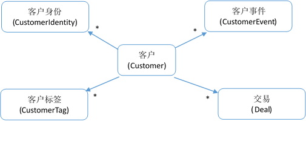
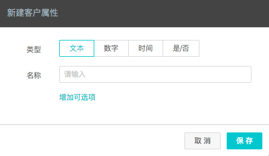
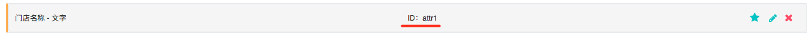

## 客户模型


DM Hub为客户内置一些比较通用的客户属性，这些属性的名称和类型如下表所示：

|属性|	界面显示名称|	类型|	说明|
| ------------ | ------- |-----| ------------------------------- |
|id|	客户ID|	Long|	只读字段|
|displayName|	显示名|	String|	只读字段。如果name不为空，等于name的值，否则等于nickName的值|
|name|	姓名|	String| |
|img|	用户头像|	String|	头像地址URL|
|gender|	性别|	Integer|	0和空代表未知，1代表男，2代表女
|mobile	|手机号码|	String| |
|mobileVerified|	手机号码是否验证|	Boolean	|值为true或false|
|email	|邮箱|	String| |
|emailVerified|	邮箱是否验证|	Boolean|	值为true或false|
|birthday|	生日|	String|	格式为:|
|wechat|	微信号	|String| |
|nickName|	微信昵称|	String| |
|country|	国家|	String| |
|province	|省份|	String| |
|city|	城市|	String| |
|county|	区/县|	String| |
|homeAddress	|家庭地址|	String|	最长512个字符|
|officeAddress|	公司地址|	String|	最长512个字符|
|qq|	QQ	|String| |
|weibo	|微博|	String| |
|stage	|当前阶段|	String| |
|dateJoin|	创建时间|	String|	格式为:“2017-06-01T12:12:12Z” 为UTC时间 对于微信粉丝，这个字段记录其关注微信的时间。|
|source	|初始来源|	String| |
|contentName|	初始来源内容|	String| |
|company	|公司|	String| |
|title	|职位|	String| |
|industry|	公司行业|	String| |
|employeeNumber|	公司员工数|	Integer| |
|annualRevenue|	公司年收入|	BigDecimal| |
|website	|公司网站|	String| |
|telephone	|座机|	String| |
|isEmployee|	是否本公司员工|	Boolean| |
|campaignId|	营销活动ID|	String| |
|campaignName|	营销活动|	String| |
|lastUpdated	|最后更新时间|	String	|只读字段，格式为:“2017-06-01T12:12:12Z”为UTC时间|
|remark|	备注|	String| |
|dateCreated|	系统创建时间|	String|	只读字段，格式为:“2017-06-01T12:12:12Z”为UTC时间|
|attr	|自定义字段	|Object|	自定义字段数据存放在该对象上|

除了系统内置的客户属性外，您还可以增加自定义属性。请登录DM Hub，并打开 设置 > 客户属性 设置页面:


进入客户属性页面后，点击右上角的 新建用户属性 按钮，新建客户属性：




新建的用户属性会在客户属性列表页显示其技术名，如attr1，attr2等：



客户自定义属性会作为客户attr字段的属性，attr字段是一个对象类型。以下是含有自定义字段attr1的客户数据的JSON示例：
```
{
    "name": "西门吹雪",
    "attr": {
        "attr1": "西门剑铺"
    }
}
```

## 客户身份模型
客户通常是跨触点的，即一个客户同时在多个触点上与您接触。比如一个客户既使用浏览器浏览您的官网，又关注了您的微信公众号，同时又在您的某网上商城购买了东西。通常情况下，客户在任一个触点，都拥有一个该触点所特有的身份信息，如网页里的cookie，微信的openid，网上商城的登录账号。在DM Hub系统中一个客户可以同时拥有多个身份。DM Hub可以通过身份信息将多个触点上的客户信息进行合并。

客户身份有身份类型和身份值两个字段组成：

|字段	|型|	说明|
| ------------ | ------- |-----|
|type	|字符串(String)|	身份类型，如wechat表示微信openid，最长32位字符。对于自定义的身份类型，进入「设置中心」点击「客户身份」并「新建客户身份」|
|value	|字符串(String)|	身份值，与type对应的值，如果type为wechat，value就是对应的openid。最长128位字符|

DM Hub内置了几个身份类型:

|内置身份类型|	含义|
| ------------ | ------- |
|wechat|	微信的openid|
|wechat-unionid|	微信的unionid|
|email	|邮箱|
|mobile|	手机号|

## 创建客户
### 带身份创建客户的API

带身份的客户创建，顾名思义是创建客户的时候提供一个或多个客户身份。如果提供的身份已绑定到DM Hub中的现有客户，那么该API便不会创建新的客户，而是更新既有客户，同时将其他身份绑定到该客户上；如果客户信息内提供了手机和邮件地址信息，并且能通过该手机号或邮件地址在DM Hub查到客户，那么该API也不会创建新客户，而是更新找到的客户，并把身份绑定到该客户身上。如果以上两种情况都没找到客户，那么该API会创建一个新客户，并将所有客户身份信息绑定到该客户上。

需要注意的是，调用该接口更新现有客户的时候，无法将客户的字段清空。如果确实想清空客户的某些字段，请调用 更新客户API

**调用请求**
```
HTTP请求方式: POST
https://api.convertlab.com/v1/customerandidentities?access_token={access_token}
POST数据示例:
{
    "customer": {
        "name": "小D",
        "mobile": "18612341234",
        "mobileVerified": true,
        "gender": 1,
        "attr":{
            "attr1":"",
            "attr2":""
        }
    },

    "customerIdentities": [
        {
            "identityType": "wechat",
            "identityValue": "o123456...",
            "identityName": "微信昵称"
        },
        {
            "identityType": "your-system-account",
            "identityValue": "user123",
            "identityName": "您系统里的用户名"
        }
    ]
}
```

**参数说明**

- {access_token}用从“获取身份权限”节拿到的access_token替换
- customerIdentities字段可以填写多个客户的身份，当身份是微信的openid时，identityType填写为”wechat”；当身份为微信的unionid时，identityType填为”wechat-unionid”。identityValue则对应的填写为客户的openid或unionid。

请求体中同时需要提供customer和customerIdentities的信息。

其中身份类型，可以使用DM Hub内置的身份类型，如wechat, wechat-unionid, mobile, email，也可以使用自定义的身份类型，对于自定义的身份类型，建议使用小写字母加中划线或下划线的方式，如taobao-account，这样便于使用身份搜索客户。

**返回结果**
```
{
  "id": 7,
  "displayName": "小D",
  "name": "小D",
  "img": null,
  "gender": 1,
  "mobile": "18612341234",
  "mobileVerified": true,
  "email": null,
  "emailVerified": false,
  "birthday": null,
  "wechat": null,
  "nickName": null,
  "country": null,
  "province": null,
  "city": null,
  "county": null,
  "homeAddress": null,
  "officeAddress": null,
  "qq": null,
  "weibo": null,
  "stage": null,
  "dateJoin": "2017-06-06T03:18:23Z",
  "source": null,
  "contentName": null,
  "company": null,
  "title": null,
  "industry": null,
  "employeeNumber": null,
  "annualRevenue": null,
  "website": null,
  "telephone": null,
  "ownerId": null,
  "ownerName": null,
  "isEmployee": false,
  "campaignId": null,
  "campaignName": null,
  "lastUpdated": "2017-06-06T03:18:23Z",
  "remark": null,
  "isMember": false,
  "dateCreated": "2017-06-06T03:18:23Z",
  "attr": {
    "attr1": null
  }
}
```

**注意事项:** 使用微信openid或unionid作为客户身份之前，请将微信公众号绑定到DM Hub系统，并将微信粉丝导入到DM Hub系统。

### 普通创建客户API

普通创建客户API会根据请求体中的手机号码和邮件地址去查找现有客户，如果能查找到客户，就会更新现有客户，否则则创建一下新客户。

**调用请求**
```
HTTP请求方式: POST
https://api.convertlab.com/v1/customers?access_token={access_token}
POST数据示例:
{
    "name": "小D",
    "mobile": "18612341234",
    "mobileVerified": true,
    "gender": 1,
    "createMethod": "ImportFromExternalSystem"
}
参数说明

{access_token} 的值为调用API的令牌，请参见 获取access_token
返回结果

{
  "id": 7,
  "displayName": "小D",
  "name": "小D",
  "img": null,
  "gender": 1,
  "mobile": "18612341234",
  "mobileVerified": true,
  "email": null,
  "emailVerified": false,
  "birthday": null,
  "wechat": null,
  "nickName": null,
  "country": null,
  "province": null,
  "city": null,
  "county": null,
  "homeAddress": null,
  "officeAddress": null,
  "qq": null,
  "weibo": null,
  "stage": null,
  "dateJoin": "2017-06-06T03:18:23Z",
  "source": null,
  "contentName": null,
  "company": null,
  "title": null,
  "industry": null,
  "employeeNumber": null,
  "annualRevenue": null,
  "website": null,
  "telephone": null,
  "ownerId": null,
  "ownerName": null,
  "isEmployee": false,
  "campaignId": null,
  "campaignName": null,
  "lastUpdated": "2017-06-06T03:18:23Z",
  "remark": null,
  "isMember": false,
  "dateCreated": "2017-06-06T03:18:23Z",
  "attr": {
    "attr1": null
  }
}
```

## 更新客户的API

调用该API可以对DM Hub系统中的客户进行修改。 需要注意的一点是，对于mobileVerified为true的手机号，在手机号码不变的情况下，无法将mobileVerified字段改为false。对于emailVerified为true的电子邮箱，在邮箱地址不变的情况下，无法将emailVerified字段改为false。

**调用请求**
```
HTTP请求方式: PUT
https://api.convertlab.com/v1/customers/{id}?access_token={access_token}
PUT数据示例：
{
    "name": "小D",
    "mobile": "18612341234",
    "mobileVerified": true,
    "gender": 1
}
```

**参数说明**

- {access_token} 访问该API的令牌，请参见 获取access_token
- id 要修改的客户id

**返回结果**

```
返回修改前的客户信息
```

## 删除客户的API
删除指定的客户

**调用请求**
```
HTTP请求方式: DELETE
https://api.convertlab.com/v1/customers/{id}?access_token={access_token}
```

**参数说明**

- access_token 访问该API的令牌，请参见 获取access_token
- id 要修改的客户id

**返回结果**
```
返回状态码为204
```

## 获取单个客户的API
**调用请求**
```
HTTP请求方式: GET
https://api.convertlab.com/v1/customers/{id}?access_token={access_token}
```

**参数说明**

- {id}是要获取客户的id
- {access_token}用从“获取身份权限”节拿到的access_token替换

**返回结果**
```
{
  "id": 7,
  "displayName": "小D",
  "name": "小D",
  "img": null,
  "gender": 1,
  "mobile": "18612341234",
  "mobileVerified": true,
  "email": null,
  "emailVerified": false,
  "birthday": null,
  "wechat": null,
  "nickName": null,
  "country": null,
  "province": null,
  "city": null,
  "county": null,
  "homeAddress": null,
  "officeAddress": null,
  "qq": null,
  "weibo": null,
  "stage": null,
  "dateJoin": "2017-06-06T03:18:23Z",
  "source": null,
  "contentName": null,
  "company": null,
  "title": null,
  "industry": null,
  "employeeNumber": null,
  "annualRevenue": null,
  "website": null,
  "telephone": null,
  "ownerId": null,
  "ownerName": null,
  "isEmployee": false,
  "campaignId": null,
  "campaignName": null,
  "lastUpdated": "2017-06-06T03:18:23Z",
  "remark": null,
  "isMember": false,
  "dateCreated": "2017-06-06T03:18:23Z",
  "attr": {
    "attr1": null
  }
}
```

## 查询客户的API
**调用请求**

```
HTTP请求方式: GET
https://api.convertlab.com/v1/customers?access_token={access_token}&stage={stage}&source={source}&mobile={mobile}&email={email}&gender={gender}&idList={idList}&dateCreatedFrom={dateCreatedFrom}&dateCreatedTo&lastUpdatedFrom={lastUpdatedFrom}&lastUpdatedTo={lastUpdatedTo}&select={select}&rows={rows}&page={page}&sidx={sidx}&sord={sord}
```

**参数说明**

|参数|	是否必填|	说明|
|-----|----|----|
|access_token|	是	|访问API的令牌|
|stage	|否|	用客户所处的阶段查询，如过查询的阶段为空，请使用stage=_empty|
|source|	否|	用客户的初始来源查询|
|mobile|	否	|用客户的手机查询|
|email	|否	|用客户的邮箱查询|
|gender|	否|	用客户的性别查询, 1代表男性，2代表女性，0代表未知|
|idList|	否	|支持以逗号分开的客户id列表，如idList=1,2,3,4|
|dateCreatedFrom	|否|	客户创建的起始时间，时间格式为 “2016-11-11T11:11:11” 为UTC事件|
|dateCreatedTo|	否	|客户创建的结束时间|
|lastUpdatedFrom	|否|	客户更新的起始时间(包含)|
|lastUpdatedTo	|否	|客户更新的结束时间|
|select|	否	|返回的字段，多个字段用逗号隔开。默认返回所有字段，可以用select指定要返回的字段|
|rows	|否	|每页的记录数，默认每页返回20行|
|page|	否	|返回第几页，默认返回第1页|
|sidx|	否|	按什么字段排序，默认按id排序|
|sord|	否	|asc表示升序，desc表示降序。默认按升序排序|

**返回结果**
- 返回的所有客户数据保存在名叫rows的array字段中
```
{
  "rows": [
    {
      "id": 1,
      "displayName": "大D",
      "name": "大D",
      "img": null,
      "gender": 1,
      "mobile": "18612341234",
      "mobileVerified": true,
      "email": null
      // 客户的其他字段
    },
    {
      "id": 7,
      "displayName": "小D",
      "name": "小D",
      "img": null,
      "gender": 1,
      "mobile": "18612341235",
      "mobileVerified": true,
      "email": null
      // 客户的其他字段
    }
  ]
}
```

## 获取客户数量的API
**调用请求**
```
HTTP请求方式: GET
https://api.convertlab.com/v1/customers/count?access_token={access_token}&stage={stage}&source={source}&mobile={mobile}&gender={gender}&idList={idList}&dateCreatedFrom={dateCreatedFrom}&dateCreatedTo&lastUpdatedFrom={lastUpdatedFrom}&lastUpdatedTo={lastUpdatedTo}
```

**参数说明**

|参数	|是否必填|	说明|
|-----|----|----|
|access_token|	是|	访问API的令牌|
|stage|	否	|用客户所处的阶段查询，如过查询的阶段为空，请使用stage=_empty|
|source	|否	|用客户的初始来源查询|
|mobile|	否|	用客户的手机查询|
|gender	|否	|用客户的性别查询, 1代表男性，2代表女性，0代表未知|
|idList	|否|	支持以逗号分开的客户id列表，如idList=1,2,3,4|
|dateCreatedFrom|	否	|客户创建的起始时间，时间格式为 “2016-11-11T11:11:11” 为UTC事件|
|dateCreatedTo|	否	|客户创建的结束时间|
|lastUpdatedFrom	|否	|客户更新的其实时间(包含)|
|lastUpdateTo|	否	|客户更新的结束时间|
|select|	否	|返回的字段，多个字段用逗号隔开。默认返回所有字段，可以用select指定要返回的字段|

**返回结果**
```
返回满足条件的客户的数量
```

## 添加客户身份的API
可以为DM Hub系统中的现有客户添加客户身份。新添加的身份将出现在客户详情页的左下角

**调用请求**
```
HTTP请求方式: POST
https://api.convertlab.com/v1/customeridentities?access_token={access_token}

POST请求示例：

{
  "customerId": "123456",
  "identityType": "myshop-account",
  "identityValue": "user12345",
  "identityName": "小羊苏西"
}
```

**参数说明**

|参数|	是否必填|	说明|
|-----|----|----|
|access_token|	是|	访问API的令牌|
|customerId|	是|	需要添加身份的客户id|
|identityType|	是|	要添加的客户身份类型，详见 客户身份模型,最长32位字符|
|identityValue|	是	|要添加的客户身份值，最长128位字符|
|identityName|	否|	客户身份对应的昵称，最长256位字符|

**返回结果**
```
{
  "customerId": "123456",
  "identityType": "myshop-account",
  "identityValue": "user12345",
  "identityName": "小羊苏西"
}
```

## 查询客户身份的API
可以根据一个或多个客户id查询客户的身份，也可以通过身份的类型和身份值查询客户id

**调用请求**
```
HTTP请求方式: GET
https://api.convertlab.com/v1/customeridentities?access_token={access_token}&customerIds={customerIds}&identityType={identityType}&identityValue={identityValue}
```

**参数说明**

|参数|	是否必填|	说明|
|-----|----|----|
|access_token|	是	|访问API的令牌|
|customerIds	|否|	要查询客户身份的客户id列表，多个客户id用逗号隔开，如 “123，124”|
|identityType|	否	|要查询客户id的身份类型，与identityValue同时使用|
|identityValue|	否|	要查询客户id的身份值，与identityType同时使用|

**返回结果**
```
[
  {
    "customerId": "123456",
    "identityType": "myshop-account",
    "identityValue": "user12345",
    "identityName": "小羊苏西"
  },
  {
    "customerId": "123456",
    "identityType": "wechat",
    "identityValue": "openid12345",
    "identityName": "小羊苏西"
  }
]
```
**返回参数说明**

- identityTyp 客户身份类型
- identityValue 客户的在你系统中的id
- customerId 客户的id
- identityName客户身份名称

## 查询客户的统计信息

**调用请求**
```
GET
/v1/customerStatistics?access_token={access_token}&rows={rows}&page={page}&sidx={sidx}&sord={sord}&customerId={customerId}
```

**请求参数说明**

|Name|	In|	Required|Type|	Description|
|-----|----|----|----|----|
|access_token|query|yes|string|用从“获取身份权限”节拿到的access_token替换|
|rows	     |query|no |number|一页包含多少条记录，默认值为5|
|page        |query|no |number|取第几页的数据，默认值为1|
|sidx        |query|no |string|用于排序的字段，默认为“id”|
|sord        |query|no |string|排序方式，asc表示升序，desc表示降序，默认为asc|
|customerId  |query|no |number|精确查询某个客户的记录|

**返回数据**
```
  {
      "items":[
          {
              "customerId": 4678,
              "firstOrderDate": "2015-04-28T03:43:33Z",
              "id": 10948,
              "lastOrderDate": "2015-04-28T03:43:33Z",
              "lastOrderDays": 635,
              "lastUpdated": "2017-01-22T16:34:03Z",
              "latest30daysScore": 0,
              "orderAMT": 0.05,
              "orderAMTA": 4.2,
              "orderAPCT": 88,
              "orderTotal": 1,
              "orderTotalAmount": 88,
              "totalScore": 0
          }
      ],
      "meta": {
          "records": 20,
          "total": 7,
          "hasNext": true
      }
  }
```

**返回数据说明**

|Name|	Type|	Description|
|-----|----|----|
|items            |array  |数据块标签|
|customerId	      |       ||
|firstOrderDate   |		  ||
|id               |number |这条记录的ID |
|lastOrderDate    |	      ||
|lastOrderDays    |       ||
|lastUpdated      |		  ||
|latest30daysScore|	      ||
|orderAMT         |		  ||
|orderAMTA	      |       ||
|orderAPCT        |		  ||
|orderTotal       |	      ||
|orderTotalAmount |		  ||
|totalScore	      |number |客户活跃度值|
|meta             |object |元数据块标签|
|records          |number |总记录条数 |
|total            |number |总页数|
|hasNext	      |boolean|是否还有记录|

