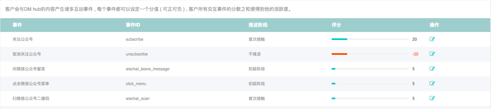
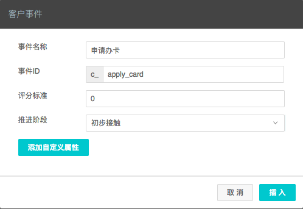
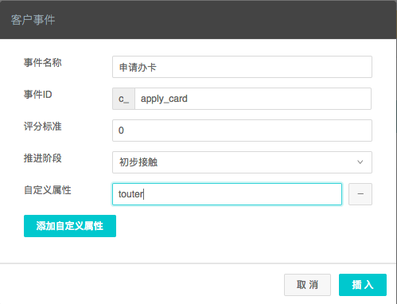

## 客户事件模型

在DM Hub中，客户的行为都是以客户事件（CustomerEvent）的形式记录的。客户事件会记录客户发生相关行为的所有信息，例如具体行为，行为发生时间，行为涉及的内容，等。DM Hub会根据客户的事件记录进行相关的客户行为分析，漏斗分析，触发自动流程等。通常来讲，客户事件是不可更改不可删除的，因为一般的，客户行为一旦发生便不可逆转。更改客户事件可能会造成DM Hub一些行为的不准确。

|     属性     | 属性意义 |类型 |              说明                |
| ------------ | ------- |-----|------------------------------- |
|id	|客户事件ID|	Long	|只读字段|
|customerId	|客户id|	Long|	发生行为的客户。|
|event	|事件类型|	String|	事件类型，最长32个英文字符。|
|targetId	|行为所关联的目标id|	String|	比如如果事件为关注公众号，targetId为公众号在DM Hub系统中的id。最长255个字符。|
|targetName|	行为所关联的目标名称	|String|	比如如果事件为关注公众号，targetName为公众号的名字。最长255个字符。|
|date|	行为所发生的时间|	String|	格式为:“2017-06-07T12:20:20Z”|
|source|	来源|	String|	预先设定的来源，比如订单是从淘宝来的，则来源可以设置为淘宝。|
|contentName|	来源内容|	String|	来源内容|
|score	|客户活跃度|	Integer|	发送该事件会给客户增加多少活跃度。|
|tag|	事件发生后为客户添加的内容标签|	String|	多个标签可以用逗号隔开。最长255个字符。|
|campaign|	营销活动code|	String|	DM Hub创建的营销活动代码|
|campaignName|	营销活动名称|	String|	DM Hub创建的营销活动的名称|
|summary|	摘要|	String|	1024个字节或汉字|
|lastUpdated|	事件记录进入在DM Hub系统的时间|	String|	只读字段|

系统已经内置了以下事件，可以通过访问DM Hub的 **设置 > 客户事件** 页面查看



该页面列出了所有内置事件的类型id，推进阶段和默认的活跃度评分。

除了系统内置事件，您还可以添加自定义事件。要添加自定义事件，请在客户设置页面点击 新建自定义事件 按钮：



在自定义事件创建对话框中，您可以设置事件的类型id，默认活跃度分数，和事件推进阶段。为了避免将来与内置事件类型发生冲突，自定义事件类型都强制以c_开头，比如上图中的事件类型id为c_apply_card。

对于自定义事件类型，除了系统内置的属性 (见 客户事件模型) 外，还能添加最多5个自定义属性。要添加自定义属性，请在自定义事件对话框内点击 添加自定义属性 按钮。

还是以申请信用卡事件c_apply_card为例，我们可以增加一个属性touter来记录地推人员的id。



由于事件规模庞大，目前将历史事件放入相应的历史分区中，查询、删除时请使用**partition**字段。具体分区信息如下：

|     时间分区     | partition | 备注 |
| ------------ | ------- |------------------------------- |
|2018年|	2018	|可以不填|
|2017年|	2017| index接口查询2017年的事件必填|
|2017年之前|	2016| index接口查询2017年之前的事件必填|

**注：系统将对事件进行去重和自动更新。如果传入externalId，系统会根据externalId处理重复事件；如果未指定externalId，则根据对于同一时间（date）、同一客户（customerId）、发生的同一事件（event）来处理。**

## 创建客户事件的API
我们以上面定义的自定义事件c_apply_card为例介绍客户事件的创建。

**调用请求**
```
HTTP请求方式: POST
https://api.convertlab.com/v1/customerevents?access_token={access_token}

POST请求示例：
{
  "customerId": "123456",
  "event": "c_apply_card",
  "targetId": "golden_card",
  "targetName": "金卡",
  "date": "2017-06-07T03:43:00Z",
  "source": "人民广场",
  "touter": "t00001"
}
```
**参数说明**
- {access_token}为访问接口的令牌
- 请求体内字段的意义请参见客户事件模型部分

**返回结果**
```
{
  "id": 1,
  "customerId": 123456,
  "event": "c_apply_card",
  "targetId": "golden_card",
  "targetName": "金卡",
  "date": "2017-06-07T03:43:00Z",
  "source": "人民广场",
  "score": 0,
  "tag": null,
  "campaign": null,
  "campaignName": null,
  "contentName": null,
  "externalId": null,
  "lastUpdated": "2017-06-07T05:38:52Z",
  "touter": "t00001"
}
```
## 获取单个事件的API

**调用请求**
```
HTTP请求方式: GET
https://api.convertlab.com/v1/customerevents/{id}?access_token={access_token}&partition={partition}
```
**参数说明**
- {access_token}用从“获取身份权限”节拿到的access_token替换
- id 客户事件id
- partition 事件年限，选填

**返回结果**
```
{
  "id": 1,
  "customerId": 123456,
  "event": "c_apply_card",
  "targetId": "golden_card",
  "targetName": "金卡",
  "date": "2017-06-07T03:43:00Z",
  "source": "人民广场",
  "score": 0,
  "tag": null,
  "campaign": null,
  "campaignName": null,
  "contentName": null,
  "externalId": null,
  "lastUpdated": "2017-06-07T05:38:52Z",
  "touter": "t00001"
}
```
## 查询事件的API

**调用请求**
```
HTTP请求方式: GET
https://api.convertlab.com/v1/customerevents?access_token={access_token}&customerId={customerId}&event={event}&lastUpdatedFrom={lastUpdatedFrom}&lastUpdatedTo={lastUpdatedTo}&partition={partition}&max={max}&rows={rows}&page={page}&sidx={sidx}&sord={sord}
```

**参数说明**

|     参数     | 是否必填 |  |
| ------------ | ------- |------------------------------- |
|access_token|	是	|访问API的令牌|
|customerId|	否|	查询指定客户的事件列表|
|event|	否|	查询指定的事件类型。多个事件类型可用逗号分开|
|lastUpdatedFrom|	否	|事件更新的起始时间。时间格式为 “2017-06-07T12:13:14Z”, 为UTC时间|
|lastUpdatedTo|	否|	事件更新的结束时间。时间格式同上|
|max	|否	|最多返回多少条数据，默认为20，最大可到1000|
|rows|	否|	每页的记录数|
|page|	否|	起始页数，以1开始|
|sidx|	否|	排序的字段，比如如果按lastUpdated排序，sidx=lastUpdated|
|sord|	否|	asc表示升序，desc表示降序，默认为升序|
|partition|	否| 分时间信息，如果不填则代表默认分表，具体分表信息请查看时间分表|

**返回结果**
```
[
  {
    "id": 1,
    "customerId": 123456,
    "event": "c_apply_card",
    "targetId": "golden_card",
    "targetName": "金卡",
    "date": "2017-06-07T03:43:00Z",
    "source": "人民广场",
    "score": 0,
    "tag": null,
    "campaign": null,
    "campaignName": null,
    "contentName": null,
    "externalId": null,
    "lastUpdated": "2017-06-07T06:43:29Z",
    "touter": "t00003"
  }
]
```
