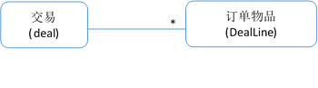

## 客户交易模型
DM Hub系统中所有交易信息都可以被记录下来。这里的交易可以是有订单发生的订单信息或没有订单行为的交易，如电话充值等。

通过客户交易接口，您可以将 交易成功 的订单导入DM Hub，也可以查询、修改和删除已经导入的订单。DM Hub会将导入的订单数据进行分析，您可以在导入后通过页面操作浏览，筛选，分析交易数据，也可以通过订单中的一些客户信息进行客户触达。

客户交易API包括查看所有订单API，增加订单API，修改订单API，查询订单API和删除订单API。这些API使用客户订单模型，如下所示。



在模型中，每一个交易都会包含n个订单物品，交易和订单物品通过订单编号相关联。具体的模型结构如下。

|属性|	属性意义|	类型|	说明|
| ------------ | ------- |-------|------------ |
|id|	客户交易ID|	Long|	只读字段|
|customerId|	客户id|	Long|	交易所属客户|
|orderNo|	订单号	|String|	交易在对接系统中的订单号|
|amountTotal	|订单总金额|	BigDecimal|	在交易中订单的总额，包括支付金额和优惠金额|
|amountPaid|	实际支付金额|	BigDecimal|	客户支付金额|
|amountDiscount|	优惠金额	|BigDecimal|	订单折扣|
|counponCode	|优惠券	|String|	优惠券码|
|groupId	|团购|	String|	团购id|
|paymentTerm	|支付方式|	String|	现金、信用卡、微信支付、支付宝等支付方式|
|paymentNo|	支付号|	String|	支付后的交易号码|
|type	|订单类型	|String|	线上、线下等类型|
|dateOrder|	订单时间|	DateTime|	订单支付完成时间，采用UTC时间格式为:“2017-06-07T12:20:20Z”|
|store	|店铺|	String|	订单店铺（线下或线上的店铺名）|
|salesChannel	|渠道|	String	|订单渠道（如线下，天猫等）|
|shippingMethod|	运送方式|	String|	货物的运送方式|
|contactName|	收货人名称|	String|	收货人名称|
|contactTel|	收货人电话|	String|	收货人电话|
|shippingProvince|	收货人省份|	String|	收货人省份|
|shippingCity	|收货人城市|	String|	收货人城市|
|shippingCounty|	收货人区县|	String	|收货人区县|
|shippingStreet|	收货人街道	|String|	收货人街道|
|shippingAddress	|收货人地址|	String|	收货人地址|

### 订单物品模型

|属性|	属性意义|	类型	|说明|
| ------------ | ------- |-------|------------ |
|orderNo|	订单号|	String|	交易在对接系统中的订单号|
|productName|	产品名称|	String|	产品名称|
|productId|	产品的ID|	String|	产品ID|
|skuId	|sku	|id|	String|
|category|	产品所属品类	|String|	产品所属品类，比如啤酒|
|qty|	订购数量|	Integer|	订购数量|
|priceUnit	|单件商品价格|	BigDecimal|	单件商品价格|
|priceSubTotal|	该商品总价|	BigDecimal|	该商品总价|

## 创建业务订单的API
订单物品放在订单的line字段中一起创建。

**调用请求**
```
http请求方式：POST
https://api.convertlab.com/v1/deals?access_token=<access_token>

POST请求示例：
{
  "customerId": 8888,
  "orderNo": "11122233344455",
  "amountTotal": 69.0,
  "amountPaid": 59.0,
  "amountDiscount": 10,
  "counponCode": "222333444",
  "groupId": "888",
  "paymentTerm": "wechat",
  "paymentNo": "555666777",
  "type": "online",
  "dateOrder": "2017-04-20T12:56:47Z",
  "store": "CL官方商城",
  "salesChannel": "tmall",
  "shippingMethod": "zto",
  "contactName": "JH",
  "contactTel": "12399988877",
  "shippingProvince": "上海",
  "shippingCity": "上海",
  "shippingCounty": "徐汇区",
  "shippingStreet": "汇谷科技园",
  "shippingAddress": "上海市徐汇区汇谷科技园1幢605",
  "lines": [
{
"productName": "啤酒6瓶装",
      "productId": "1497",
"skuId": "149766666",
"category": "啤酒",
      "qty": 1,
      "priceUnit": 69.0,
      "priceSubTotal": 69.0
    }
  ]
}
```

**参数说明**

|参数|	是否必填|	说明|
| ------------ | ------- |------------- |
|id|	是|	客户交易ID|
|customerId|	是|	客户id|
|orderNo|	是	|订单号|
|amountTotal	|是	|订单总金额|
|amountPaid|	是	|实际支付金额|
|amountDiscount|	是	|优惠金额|
|counponCode|	否	|优惠券|
|groupId|	否|	团购|
|paymentTerm	|否|	支付方式|
|paymentNo|	否|	支付号|
|type|	否	|订单类型|
|dateOrder	|是	|订单时间|
|store	|否	|店铺|
|salesChannel|	否|	渠道|
|shippingMethod|	否	|运送方式|
|contactName|	否	|收货人名称|
|contactTel|	否|	收货人电话|
|shippingProvince|	否	|收货人省份|
|shippingCity	|否|	收货人城市|
|shippingCounty|	否|	收货人区县|
|shippingStreet|	否|	收货人街道|
|shippingAddress	|否	|收货人地址|
|lines|	否	|订单物品|
|productName|	否|	产品名称|
|productId	|否|	产品ID|
|skuId|	否	|SkuID|
|category|	否|	产品所属品类|
|qty|	是	|订购数量|
|priceUnit|	否	|单件商品价格|
|priceSubTotal|	否	|该商品总价|

**返回结果**
```
{
  "id": 1234,
  "customerId": 8888,
  "orderNo": "11122233344455",
  "amountTotal": 69.0,
  "amountPaid": 59.0,
  "amountDiscount": 10,
  "counponCode": "222333444",
  "groupId": "888",
  "paymentTerm": "wechat",
  "paymentNo": "555666777",
  "type": "online",
  "dateOrder": "2017-04-20T12:56:47Z",
  "store": "CL官方商城",
  "salesChannel": "tmall",
  "shippingMethod": "zto",
  "contactName": "JH",
  "contactTel": "12399988877",
  "shippingProvince": "上海",
  "shippingCity": "上海",
  "shippingCounty": "徐汇区",
  "shippingStreet": "汇谷科技园",
  "shippingAddress": "上海市徐汇区汇谷科技园1幢605",
  "lines": [
{
"productName": "啤酒6瓶装",
      "productId": "1497",
      "skuId": "149766666",
      "category": "啤酒",
      "qty": 1,
      "priceUnit": 69.0,
      "priceSubTotal": 69.0
    }
  ]
}
```

## 查询订单的API
**调用请求**
```
HTTP请求方法GET

https://api.convertlab.com/v1/deals/{id}?access_token={access_token}
```

**参数说明**

|参数|	是否必填|	说明|
| ------------ | ------- |----------- |
|access_token|	是	|请求凭证|
|id	|是	|客户交易ID|

**返回数据**
```
{
  "id": 1234,
  "customerId": 8888,
  "orderNo": "11122233344455",
  "amountTotal": 69.0,
  "amountPaid": 59.0,
  "amountDiscount": 10,
  "counponCode": "222333444",
  "groupId": "888",
  "paymentTerm": "wechat",
  "paymentNo": "555666777",
  "type": "online",
  "dateOrder": "2017-04-20T12:56:47Z",
  "store": "CL官方商城",
  "salesChannel": "tmall",
  "shippingMethod": "zto",
  "contactName": "JH",
  "contactTel": "12399988877",
  "shippingProvince": "上海",
  "shippingCity": "上海",
  "shippingCounty": "徐汇区",
  "shippingStreet": "汇谷科技园",
  "shippingAddress": "上海市徐汇区汇谷科技园1幢605",
  "lines": [
{
    "productName": "啤酒6瓶装",
        "productId": "1497",
    "skuId": "149766666",
    "category": "啤酒",
        "qty": 1,
        "priceUnit": 69.0,
        "priceSubTotal": 69.0
    }
  ]
}
```

## 查询所有订单的API
**调用请求**
```
http请求方式：GET
https://api.convertlab.com/v1/deals?access_token={access_token}&rows={rows}&page={page}&sidx={sidx}&sord={sord}
```

**参数说明**

|参数	|是否必填|	说明|
| ------------ | ------- |--------- |
|access_token|	是|	请求凭证|
|rows|	否|	每页的记录数|
|page	|否	|起始页数，以1开始|
|sidx|	否|	排序的字段，默认按id排序|
|sord	|否	|asc表示升序，desc表示降序，默认为升序|

**返回结果**
```
{
  "page": 1,
  "records": 1,
  "rows": [
    {
      "id": 1234,
      "customerId": 8888,
      "orderNo": "11122233344455",
      "amountTotal": 69.0,
      "amountPaid": 59.0,
      "amountDiscount": 10,
      "counponCode": "222333444",
      "groupId": "888",
      "paymentTerm": "wechat",
      "paymentNo": "555666777",
      "type": "online",
      "dateOrder": "2017-04-20T12:56:47Z",
      "store": "CL官方商城",
      "salesChannel": "tmall",
      "shippingMethod": "zto",
      "contactName": "JH",
      "contactTel": "12399988877",
      "shippingProvince": "上海",
      "shippingCity": "上海",
      "shippingCounty": "徐汇区",
      "shippingStreet": "汇谷科技园",
      "shippingAddress": "上海市徐汇区汇谷科技园1幢605",
      "lines": [
        {
          "productName": "啤酒6瓶装",
          "productId": "1497",
          "skuId": "149766666",
          "category": "啤酒",
          "qty": 1,
          "priceUnit": 69.0,
          "priceSubTotal": 69.0
        }
      ]
    }
  ]
```

## 修改业务订单的API
所有订单相关字段均可以修改

**调用请求**
```
http请求方式：PUT
https://api.convertlab.com/v1/deals/{id}?access_token={access_token}

PUT请求示例：
{
  "contactName": "CL",
  "contactTel": "18566677788",
}
```

**参数说明**

|参数|	是否必填|	说明|
| ------------ | ------- |-------- |
|access_token|	是|	请求凭证|

**返回结果**
```
{
  "id": 1234,
  "customerId": 8888,
  "orderNo": "11122233344455",
  "amountTotal": 69.0,
  "amountPaid": 59.0,
  "amountDiscount": 10,
  "counponCode": "222333444",
  "groupId": "888",
  "paymentTerm": "wechat",
  "paymentNo": "555666777",
  "type": "online",
  "dateOrder": "2017-04-20T12:56:47Z",
  "store": "CL官方商城",
  "salesChannel": "tmall",
  "shippingMethod": "zto",
  "contactName": "CL",
  "contactTel": "18566677788",
  "shippingProvince": "上海",
  "shippingCity": "上海",
  "shippingCounty": "徐汇区",
  "shippingStreet": "汇谷科技园",
  "shippingAddress": "上海市徐汇区汇谷科技园1幢605",
  "lines": [
{
      "productName": "啤酒6瓶装",
      "productId": "1497",
      "skuId": "149766666",
      "category": "啤酒",
      "qty": 1,
      "priceUnit": 69.0,
      "priceSubTotal": 69.0
    }
  ]
}
```

## 删除业务订单的API
**调用请求**

```
http请求方式：DELETE
https://api.convertlab.com/v1/deals/{id}?access_token={access_token}
```

**参数说明**

|参数|	是否必填|	说明|
| ------------ | ------- |----------- |
|access_token|	是	|请求凭证|
