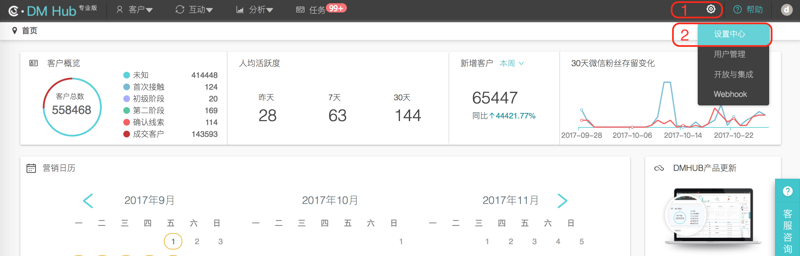
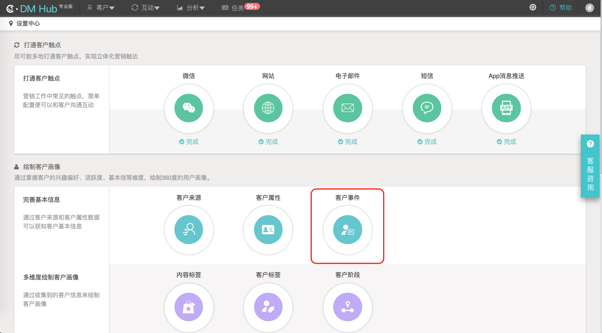
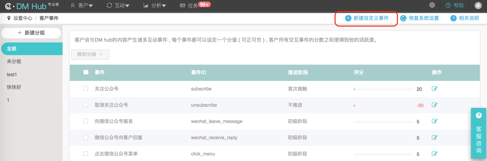
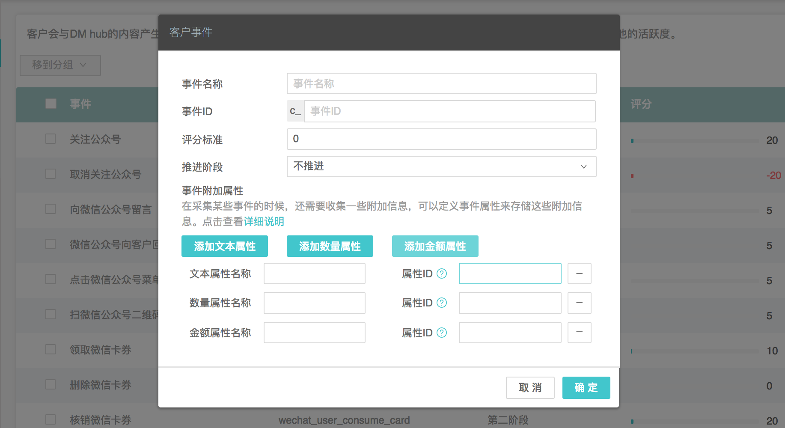

# 新建自定义事件

## 1. 进入设置中心页面

点击 DM Hub 平台首页右上角的齿轮图标，选择 `设置中心` 选项，进入设置中心页面。

## 2. 进入客户事件页面

在设置中心页面选择 `客户事件` 选项进入客户事件页面。

## 3. 新建自定义事件

在客户事件页面点击 `+ 新建自定义事件` 按钮，在弹出的窗口中新建自定义事件。

在新建自定义事件时可以添加自定义属性。

