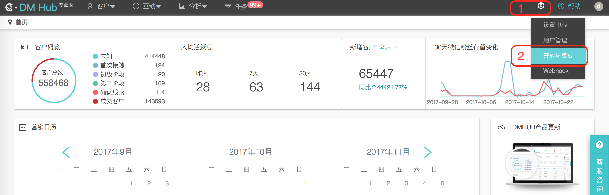
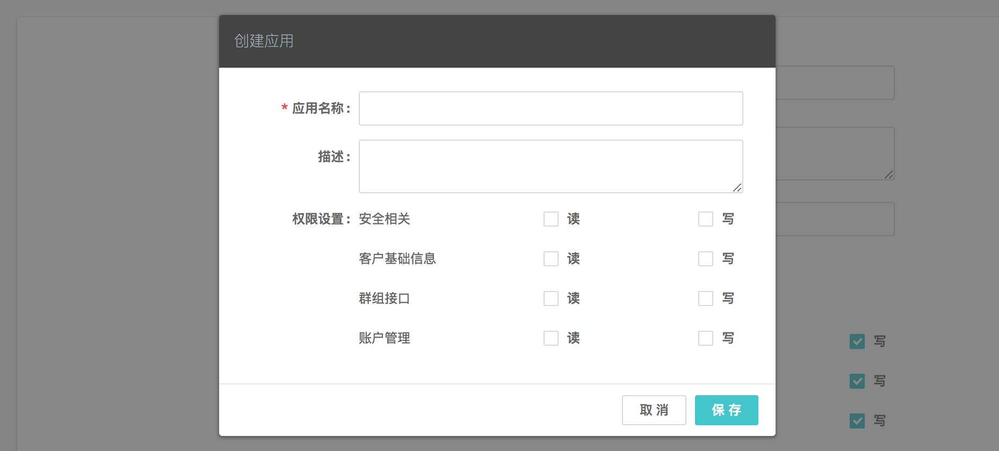

## 1. 使用说明

- 本文是 DMHub Android SDK 标准的开发指南文档，用以指导 SDK 的集成和使用，默认读者已经具备一定的 Android 开发能力。
- 本篇指南匹配的 DMHub Android SDK 版本为： `v2.0.0` 。
- DMHub Android SDK 2.0.0 要求  `Java >= 1.7`  &  `Android API >= 14` 。

## 2. 创建应用

集成 DMHub SDK 之前，您首先需要到 DM Hub 平台创建应用。

### 2.1 进入应用设置页面

点击 DM Hub 平台首页右上角的齿轮图标，选择 `开放与集成` 选项，进入应用设置页面。



### 2.2 新建应用

在应用设置页面点击右上角的 `+ 新建` 按钮，在弹出的创建应用弹出框中填写应用信息后保存。应用创建成功之后，即可获得集成 SDK 所需的 appid。



## 3. 导入 SDK

### 3.1 下载 SDK

[点击下载](https://github.com/xsio/open_api_docs/raw/master/sdk/dmhubsdk-android/dmhubsdk-android-2.0.0.zip)

### 3.2 添加 jar 包

下载解压后复制 dmhubsdk-android-2.0.0.jar 文件到工程主 module 的 libs 目录下，右键 jar 包，选择 `Add As Library...` ，将 jar 包作为 Library 添加到主 module 中。

### 3.3 配置 AndroidManifest.xml

- 配置 SDK 所需权限

```xml
<uses-permission android:name="android.permission.INTERNET" />
<uses-permission android:name="android.permission.READ_PHONE_STATE" />
<uses-permission android:name="android.permission.ACCESS_NETWORK_STATE" />
<uses-permission android:name="android.permission.ACCESS_WIFI_STATE" />
<uses-permission android:name="android.permission.BLUETOOTH" />
```

- 配置 SDK 所需参数

在 AndroidManifest.xml 中的 `<application></application>` 标签内配置 SDK 相关参数：

```xml
<!-- DMHubSDK 相关参数 -->
<meta-data
    android:name="com.convertlab.dmhubsdk.config.DMHubSDKAppId"
    android:value="[Must Configure] The appid get from DM Hub." />
<meta-data
    android:name="com.convertlab.dmhubsdk.config.Endpoint"
    android:value="A string URL endpoint. If you are not running DMHubSDK in the standard production environment, you need to configure this value. Defaults to 'https://api.convertlab.com'" />
<meta-data
    android:name="com.convertlab.dmhubsdk.config.EnableDebugLogging"
    android:value="A boolean value. If true, emit more detailed log messages. Defaults to false." />
<meta-data
    android:name="com.convertlab.dmhubsdk.config.FlushInterval"
    android:value="An integer number of milliseconds, the maximum time to wait before upload if the bulk upload limit isn't reached. Defaults to 30000 millis" />
<meta-data
    android:name="com.convertlab.dmhubsdk.config.BulkUploadLimit"
    android:value="An integer count of events, the maximum number of events to queue before an upload attempt. This value should less than 50. Defaults to 40." />
<meta-data
    android:name="com.convertlab.dmhubsdk.config.UploadOnlyWifi"
    android:value="A boolean value. If true, upload data only in wifi environment. Defaults to false." />
<meta-data
    android:name="com.convertlab.dmhubsdk.config.MaximumBackgroundDuration"
    android:value="An integer number of milliseconds, if App enters the background more than this duration and open again from background, we will count as a new open. Defaults to 30000 millis." />
```

## 4. 初始化

使用 SDK 记录事件之前需要先进行初始化，在整个应用程序全局，只需要进行一次初始化。
- 接口定义

```java
/**
 * 在自定义的 Application 中初始化 DMHubSDK
 * 在整个应用程序全局，只需要进行一次初始化
 */
public static void init(@NonNull final Context context);
```

- 代码示例

在自定义的 `Application` 中的 `onCreate` 方法中开启调试模式并进行初始化：

```java
public class YourApp extends Application {
    
    @Override
    public void onCreate() {
        super.onCreate();

        // 初始化 DMHubSDK
        DMHubSDK.init(this);
    }
}
```

## 5. 客户身份

客户身份是 DM Hub 中客户的标识，App 端 SDK 采集到的客户事件以及客户相关信息需要通过客户身份与客户进行绑定。

### 5.1 设置客户身份

为了将客户事件以及客户相关信息与客户绑定，需要在 App 获取到客户身份信息时（如客户注册或登录），设置客户身份。

多次调用设置身份接口，新的身份将会覆盖旧的身份，此后产生的客户事件将与新身份对应的客户绑定。

客户在未设置客户身份期间产生的事件将会作为匿名事件进行记录，匿名事件会保存 30 天。

- 接口定义

```java
/**
 * 设置客户身份，用于绑定事件
 * 如果重复设置，将会使用新的客户身份进行事件绑定
 */
public static void setIdentity(final String identityType, final String identityValue);
```

### 5.2 当前客户身份

获取当前设置的客户身份。

- 接口定义

```java
/**
 * 获取当前设置的客户身份
 * @return 如果当前还未设置过有效的客户身份，返回 null
 */
public static DMHubIdentity currentIdentity();
```

### 5.3 清除客户身份

清除客户身份之后产生的客户事件将会作为匿名事件进行记录。

- 接口定义

```java
/**
 * 清除当前设置的客户身份
 * @return 当前设置的客户身份，如果当前还未设置过有效的客户身份，返回 null
 */
public static DMHubIdentity clearIdentity();
```

## 6. 跟踪客户事件

### 6.1 跟踪自定义客户事件

根据业务需求在 DM Hub 后台 [新建自定义事件](https://github.com/xsio/open_api_docs/blob/master/docs/track/EVENT_GUIDE.md) 后，可以调用该 API 对自定义客户事件进行跟踪。在新建自定义事件时，还可以根据需要添加自定义属性，并在调用 API 时作为参数传入。

- 接口定义

```java
/**
 * 跟踪自定义客户事件
 *
 * @param eventId    在 DM Hub 中新建的自定义事件的事件 Id
 * @param properties 事件的自定义属性，必须以在 DM Hub 中新建自定义事件时添加的自定义属性作为 key
 */
public static void trackMap(final String eventId, final Map<String, Object> properties);

/**
 * 跟踪自定义客户事件
 *
 * @param eventId    在 DM Hub 中新建的自定义事件的事件 Id
 * @param properties 事件的自定义属性，必须以在 DM Hub 中新建自定义事件时添加的自定义属性作为 key
 */
public static void track(final String eventId, JSONObject properties);

/**
 * 跟踪自定义客户事件
 *
 * @param eventId 在 DM Hub 中新建的自定义事件的事件 Id
 */
public static void track(final String eventId);
```

### 6.2 跟踪进入、离开视图事件

- 接口定义

```java
/**
 * 跟踪进入视图事件
 *
 * @param viewName 视图的名称，客户时间轴上的显示为：'进入手机视图 ${viewName}'
 */
public static void trackOpenView(final String viewName);

/**
 * 跟踪离开视图事件
 *
 * @param viewName 视图的名称，客户时间轴上的显示为：'离开手机视图 ${viewName}'
 */
public static void trackExitView(final String viewName);
```

- 代码示例

```java
public class YourActivity extends Activity {
    
    @Override
    protected void onResume() {
        super.onResume();
        
        DMHubSDK.trackOpenView("<viewName>");
    }

    @Override
    protected void onPause() {
        super.onPause();

        DMHubSDK.trackExitView("<viewName>");
    }
}
```

### 6.3 跟踪通知推送相关事件

如果您使用了 DM Hub 平台提供的通知推送功能，则可以调用 SDK 提供的相关 API 对来自 DM Hub 平台的通知推送相关事件进行跟踪。

#### 6.3.1 跟踪 JPush 推送相关事件

- 接口定义

```java
/**
 * 当自定义的 JPush 广播接收器收到来自 JPush 的广播时调用
 *
 * @param intent 收到的广播的 intent
 */
public static void onJPushReceiveBroadcast(final Intent intent);
```

- 代码示例

```java
public class YourJPushReceiver extends BroadcastReceiver {

    @Override
    public void onReceive(Context context, Intent intent) {
        DMHubSDK.onJPushReceiveBroadcast(intent);
    }
}
```

#### 6.3.2 跟踪 GeTui 推送相关事件

- 接口定义

```java
/**
 * 在自定义的 GTIntentService 的 onReceiveClientId 方法中调用
 *
 * @param clientId 收到的 clientId
 */
public static void onGeTuiReceiveClientId(final String clientId);

/**
 * 在自定义的 GTIntentService 的 onReceiveMessageData 方法中调用
 *
 * @param taskId    GTTransmitMessage 中携带的 taskId
 * @param messageId GTTransmitMessage 中携带的 messageId
 * @param payload   GTTransmitMessage 中携带的 payload
 */
public static void onGeTuiReceiveMessageData(final String taskId, final String messageId, final byte[] payload);

/**
 * 在自定义的 GTIntentService 的 onNotificationMessageArrived 方法中调用
 *
 * @param taskId    GTNotificationMessage 中携带的 taskId
 * @param messageId GTNotificationMessage 中携带的 messageId
 */
public static void onGeTuiNotificationMessageArrived(final String taskId, final String messageId);
```

- 代码示例

```java
public class YourIntentService extends GTIntentService {

    @Override
    public void onReceiveClientId(Context context, String clientid) {
        DMHubSDK.onGeTuiReceiveClientId(clientid);
    }

    @Override
    public void onReceiveMessageData(Context context, GTTransmitMessage msg) {
        String taskId = msg.getTaskId();
        String messageId = msg.getMessageId();
        byte[] payload = msg.getPayload();
        DMHubSDK.onGeTuiReceiveMessageData(taskId, messageId, payload);
    }

    @Override
    public void onNotificationMessageArrived(Context context, GTNotificationMessage gtNotificationMessage) {
        String taskId = gtNotificationMessage.getTaskId();
        String messageId = gtNotificationMessage.getMessageId();
        DMHubSDK.onGeTuiNotificationMessageArrived(taskId, messageId);
    }
}
```

## 7. 混淆规则

在工程的混淆规则文件中添加如下规则：

```prolog
# DMHubSDK
-dontwarn com.convertlab.**
-keep class com.convertlab.** { *; }
```
