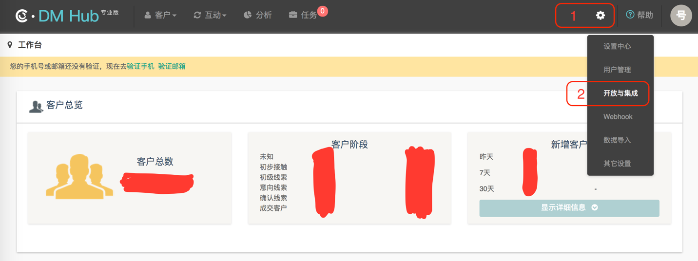

# iOS SDK 开发指南


# 1. 使用说明

- 本文是 DMHub iOS SDK 标准的开发指南文档，用以指导 SDK 的集成和使用，默认读者已经具备一定的 iOS 开发能力。
- 本篇指南匹配的 DMHub iOS SDK 版本为： `v0.1.0` 。
- DMHub iOS SDK 0.1.0 要求  `iOS >= 6.0` 。

# 2. 开发准备

### 2.1 创建应用

集成 DMHub SDK 之前，您首先需要到 DM Hub 平台创建应用。

#### 2.1.1 进入应用设置页面

点击 DM Hub 平台首页右上角的齿轮图标，选择 `开放与集成` 选项，进入应用设置页面。



#### 2.1.2 新建应用

在应用设置页面点击右上角的 `+ 新建` 按钮，在弹出的创建应用弹出框中填写应用名称和描述后保存。


#### 2.1.3 更新权限设置

创建应用成功之后，即可获得集成 SDK 所需的 appid 和 secret 信息。根据开发需求进行权限设置后，点击右下角的 `更新` 按钮（注：即使没有更改权限设置，也要进行更新），完成应用创建。


### 2.2 工程准备

集成 `极光推送` 或 `个推推送` 。

# 3. 导入 SDK

### 3.1 添加 SDK 文件

在 Xcode 中选择 `File` ---> `Add Files to “YOUR_PROJECT_NAME”...` ，将 libs 目录下的 DMHubSDK.h 头文件和 dmhubsdk-ios-x.x.x.a 静态库文件添加到工程目录中。

### 3.2 添加系统库支持

在 `TARGETS` ---> `General` ---> `Linked Frameworks and Libraries` 下，添加以下系统库支持：

```tex
UIKit.framework
Foundation.framework
SystemConfiguration.framework
libsqlite3.tbd
AdSupport.framework （如果不使用 IDFA，则不需要添加该系统库）
```

### 3.3 检查静态库文件路径

检查 `TARGETS` ---> `Build Settings` ---> `Search Paths` 下的 `Library Search Paths` 。一般情况下，添加 dmhubsdk-ios-x.x.x.a 静态库文件时，Xcode 会自动在 `Library Search Paths` 中添加 `$(PROJECT_DIR)/{静态库文件所在相对目录}` ，如果没有，请手动添加。

### 3.4 引入头文件

在需要使用 DMHubSDK 功能的文件中引入头文件：

```objectivec
#import "DMHubSDK.h"
```

# 4. 配置 SDK 相关参数

右键单击 Info.plist 文件，`Open As` ---> `Source Code` ，配置 SDK 所需参数：

```xml
<key>DMHubSDKAppId</key>
<string>在 DM Hub 平台获得的 appid</string>

<key>DMHubSDKSecret</key>
<string>在 DM Hub 平台获得的 secret</string>

<!--
    您所采用的推送平台，支持极光和个推。
    如果您采用极光推送，请填写 'jpush'(默认，可以不配置)；
    如果您采用个推推送，请填写 'getui'；
    如果您同时采用极光推送和个推推送，请填写 'jpush&amp;getui'。
-->
<key>DMHubPushChannel</key>
<string>采用的推送平台</string>
```

如果您是在测试账号下创建的应用，则需要设置支持 Http 传输，并配置 `DMHubServer` 参数：

```xml
<key>NSAppTransportSecurity</key>
<dict>
    <key>NSAllowsArbitraryLoads</key>
    <true/>
</dict>

<key>DMHubServer</key>
<string>http://api.convertwork.cn</string>
```

# 5. 创建客户和客户身份

为了跟踪客户事件，需要先创建客户和客户身份，DMHubSDK 提供了以下三个 API 来创建客户和客户身份，请开发者根据项目需求调用。

以下三个 API ，如果重复调用并传入相同参数，则不会重复进行处理；如果客户已经存在，则不会重复创建客户，而只是将传入的身份信息与客户绑定；创建客户和客户身份的 API 与跟踪客户事件的 API 在调用上不需要区分先后顺序，SDK 内部会进行处理。

### 5.1 创建带有 JPush 身份的客户

如果您采用了极光推送，请在 `AppDelegate.m` 文件中调用此 API 创建带有 JPush 身份的客户。

- 接口定义

```objectivec
/**
 添加客户的 JPush 身份信息

 @param jPushAppKey JPush 的 AppKey
 @param jPushId     JPush SDK 向 JPush Server 注册得到的注册 Id
 */
- (void)fetchJPushAppKey:(NSString *_Nonnull)jPushAppKey
                 jPushId:(NSString *_Nonnull)jPushId;
```

- 代码示例

```objectivec
// AppDelegate.m

@implementation AppDelegate

- (BOOL)application:(UIApplication *)application didFinishLaunchingWithOptions:(NSDictionary *)launchOptions {
    [JPUSHService registrationIDCompletionHandler:^(int resCode, NSString *registrationID) {
        // 添加客户的 JPush 身份信息
        [[DMHubSDK shared] fetchJPushAppKey:@"JPush 的 AppKey" jPushId:registrationID];
    }];
}

@end
```

### 5.2 创建带有 GeTui 身份的客户

如果您采用了个推推送，请在 `AppDelegate.m` 文件中调用此 API 创建带有 GeTui 身份的客户。

- 接口定义

```objectivec
/**
 添加客户的 GeTui 身份信息

 @param geTuiAppKey GeTui 的 AppKey
 @param geTuiId     GeTui SDK 向 GeTui Server 注册得到的 clientId
 */
- (void)fetchGeTuiAppKey:(NSString *_Nonnull)geTuiAppKey
                 geTuiId:(NSString *_Nonnull)geTuiId;
```

- 代码示例

```objectivec
// GeTuiSdkDelegate 的回调方法
- (void)GeTuiSdkDidRegisterClient:(NSString *)clientId {
    // 添加客户的 GeTui 身份信息
    [[DMHubSDK shared] fetchGeTuiAppKey:@"GeTui 的 AppKey" geTuiId:clientId];
}
```

### 5.3 创建带有广告标识符（IDFA）身份的客户

如果需要上传 IDFA 作为客户身份，请在 `AppDelegate.m` 文件中调用此 API 创建带有广告标识符（IDFA）身份的客户。

- 接口定义

```objectivec
/**
 添加客户的广告标识符（IDFA）信息

 如果不需要使用 IDFA，请不要调用此方法。调用此方法后，IDFA 将会添加为客户的一个身份

 @param advertisingIdentifier 广告标识符（IDFA）
 */
- (void)fetchIdfa:(NSString *_Nonnull)advertisingIdentifier;
```

- 代码示例

```objectivec
// AppDelegate.m
// 导入 IDFA 功能所需头文件
#import <AdSupport/AdSupport.h>

@implementation AppDelegate

- (BOOL)application:(UIApplication *)application didFinishLaunchingWithOptions:(NSDictionary *)launchOptions {
    // 获取 IDFA
    NSString *idfa = [[[ASIdentifierManager sharedManager] advertisingIdentifier] UUIDString];
    // 添加客户的广告标识符（IDFA）信息
    [[DMHubSDK shared] fetchIdfa:idfa];
}

@end
```

# 6. 跟踪客户事件

DMHubSDK 提供了以下 API 来跟踪客户事件，请开发者根据项目需求调用。

DM Hub 平台预置了 4 个客户事件：`打开手机应用` 、`进入手机视图`、`收到手机应用通知`、`点击手机应用通知`。

对于 DM Hub 平台预置事件，DMHubSDK 会默认跟踪 `打开手机应用` 事件，其余三个预置事件需要由开发者自行调用 SDK 提供的 API，并根据接口定义传入正确参数；对于推送通知相关事件，SDK 只会对由 DM Hub 平台发出的推送通知引发的客户事件进行记录。

对于自定义事件，需要先在 DM Hub 后台新建自定义事件，在新建自定义事件时，还可以根据业务需要添加自定义属性。在调用跟踪客户自定义事件的 API 时，可以传入自定义属性。

对于离线状态下产生的客户事件，SDK 会先存储到本地，当检测到有网络连接时再发送给 DM Hub 平台。

### 6.1 跟踪预置客户事件

#### 6.1.1 跟踪进入视图事件

- 接口定义

```objectivec
/**
 跟踪进入视图事件

 @param viewName 视图的名称，客户时间轴上的显示为：'进入手机视图 ${viewName}'
 */
- (void)trackOpenView:(NSString *_Nonnull)viewName;
```

- 代码示例

```objectivec
@implementation ViewController

- (void)viewDidAppear:(BOOL)animated {
    [super viewDidAppear:animated];

    // 跟踪进入视图事件
    [[DMHubSDK shared] trackOpenView:@"{viewName}"];
}

@end
```

#### 6.1.2 跟踪推送通知事件

- 接口定义

```objectivec
/**
 跟踪收到推送通知事件

 @param userInfo 推送通知中的 userInfo
 @return 如果传入的 userInfo 对应的推送通知来自 DM Hub 平台，返回 YES；否则，返回 NO
 */
- (BOOL)trackReceiveNotification:(NSDictionary *_Nonnull)userInfo;

/**
 跟踪点击推送通知事件

 @param userInfo 推送通知中的 userInfo
 @return 如果传入的 userInfo 对应的推送通知来自 DM Hub 平台，返回 YES；否则，返回 NO
 */
- (BOOL)trackClickNotification:(NSDictionary *_Nonnull)userInfo;
```

- 代码示例

```objectivec
// 在收到推送通知和点击推送通知的回调方法中进行调用，由于不同的系统版本、不同的推送平台等因素会导致回调方法也不同，因此此处仅示例在部分回调方法中如何进行调用
@implementation AppDelegate

// iOS 7 及以上系统收到通知的回调
- (void)application:(UIApplication *)application didReceiveRemoteNotification:(NSDictionary *)userInfo fetchCompletionHandler:(void (^)(UIBackgroundFetchResult))completionHandler {
    // 跟踪收到推送通知事件
    [[DMHubSDK shared] trackReceiveNotification:userInfo];
}

// iOS 6 及以下系统受到通知的回调
- (void)application:(UIApplication *)application didReceiveRemoteNotification:(NSDictionary *)userInfo {
    // 跟踪收到推送通知事件
    [[DMHubSDK shared] trackReceiveNotification:userInfo];
}

#ifdef NSFoundationVersionNumber_iOS_9_x_Max
#pragma mark - JPUSHRegisterDelegate
- (void)jpushNotificationCenter:(UNUserNotificationCenter *)center willPresentNotification:(UNNotification *)notification withCompletionHandler:(void (^)(NSInteger))completionHandler {
    NSDictionary *userInfo = notification.request.content.userInfo;
    // 跟踪收到推送通知事件
    [[DMHubSDK shared] trackReceiveNotification:userInfo];
}

- (void)jpushNotificationCenter:(UNUserNotificationCenter *)center didReceiveNotificationResponse:(UNNotificationResponse *)response withCompletionHandler:(void (^)())completionHandler {
    NSDictionary *userInfo = response.notification.request.content.userInfo;
    // 跟踪点击推送通知事件
    [[DMHubSDK shared] trackClickNotification:userInfo];
}
#endif

#if __IPHONE_OS_VERSION_MAX_ALLOWED >= __IPHONE_10_0
- (void)userNotificationCenter:(UNUserNotificationCenter *)center willPresentNotification:(UNNotification *)notification withCompletionHandler:(void (^)(UNNotificationPresentationOptions))completionHandler {
    NSDictionary *userInfo = notification.request.content.userInfo;
    // 跟踪收到推送通知事件
    [[DMHubSDK shared] trackReceiveNotification:userInfo];
}

- (void)userNotificationCenter:(UNUserNotificationCenter *)center didReceiveNotificationResponse:(UNNotificationResponse *)response withCompletionHandler:(void (^)())completionHandler {
    NSDictionary *userInfo = response.notification.request.content.userInfo;
    // 跟踪点击推送通知事件
    [[DMHubSDK shared] trackClickNotification:userInfo];
}
#endif

@end
```

#### 6.1.3 跟踪收到 JPush 自定义消息事件

- 接口定义

```objectivec
/**
 跟踪收到 JPush 自定义消息事件

 @param notification JPush 收到自定义消息的回调方法中传入的 notification
 @return 如果传入的 notification 对应的 JPush 自定义消息来自 DM Hub 平台，返回 YES；否则，返回 NO
 */
- (BOOL)trackReceiveJPushMessage:(NSNotification *_Nonnull)notification;
```

- 代码示例

```objectivec
- (void)didReceiveJPushMessage:(NSNotification *)notification {
    [[DMHubSDK shared] trackReceiveJPushMessage:notification];
}
```

#### 6.1.4 跟踪收到 GeTui 透传消息事件

- 接口定义

```objectivec
/**
 跟踪收到 GeTui 透传消息事件

 @param payloadData GeTui 收到透传消息的回调方法中传入的 payloadData
 @param offLine GeTui 收到透传消息的回调方法中传入的 offLine
 @return 如果传入的 payloadData 对应的 GeTui 透传消息来自 DM Hub 平台，返回 YES；否则，返回 NO
 */
- (BOOL)trackReceiveGeTuiPayloadData:(NSData *_Nonnull)payloadData
                             offLine:(BOOL)offLine;
```

- 代码示例

```objectivec
- (void)GeTuiSdkDidReceivePayloadData:(NSData *)payloadData andTaskId:(NSString *)taskId andMsgId:(NSString *)msgId andOffLine:(BOOL)offLine fromGtAppId:(NSString *)appId {
    [[DMHubSDK shared] trackReceiveGeTuiPayloadData:payloadData offLine:offLine];
}
```

### 6.2 跟踪自定义客户事件

在 DM Hub 后台新建的自定义事件，可以通过调用此 API 进行跟踪。

```objectivec
/**
 跟踪自定义客户事件

 @param eventId    与 DM Hub 中新建的自定义事件对应的事件 Id
 @param targetName 对于自定义事件，客户时间轴上只会显示 targetName，相当于事件标题
 @param targetId   客户触发该事件对应的目标(如按钮)的 Id
 @param properties 事件的自定义属性，必须以在 DM Hub 中新建自定义事件时添加的自定义属性作为 key
 */
typedef NSDictionary<NSString *, NSString *> * Properties;
- (void)trackWithEventId:(NSString *_Nonnull)eventId
              targetName:(NSString *_Nonnull)targetName
                targetId:(NSString *_Nullable)targetId
              properties:(Properties _Nullable)properties;
```

# 7. 技术支持

- 在线客服：在 DM Hub 平台右下角进行客服咨询
- 电子邮件：<support@convertlab.com>
