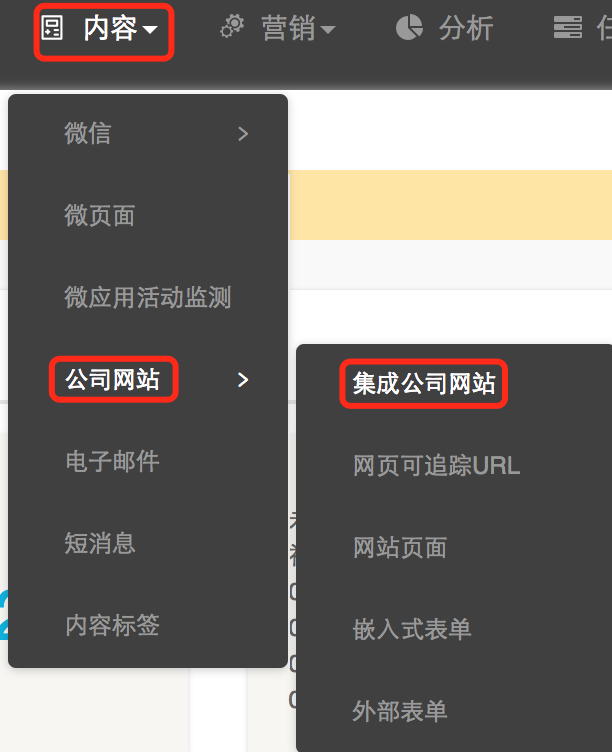
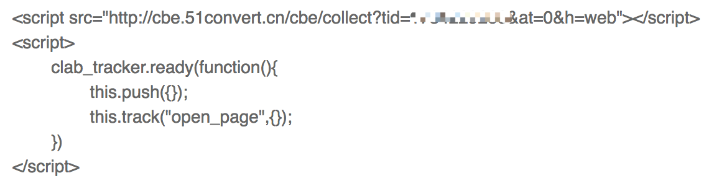

## 设置埋点

登录DM Hub系统，点击菜单 **内容>公司网站>集成公司网站：**



按照页面的描述文字，将页面内的javascript代码放在官网主页的之前。 如：



**说明**

1. this.push({})中的参数是一个JSON对象，该JSON对象便是整个页面追踪过程的上下文(context)信息，我们称之为页面参数(page parameters)。该JSON可以包含以下字段如下：

|字段名|	字段类型|	字段描述|
| ------------ | ------- |----------- |
|channelType|	String|	表示集成的触点类型，需要小写英文字母，比如公司的英文名，或者网站的域名|
|channelName	|String|	触点的名字，比如公司网站的名字|
|userId|	String|	用户标识，如果公司网站有用户体系，可以是用户的id。|
|source|	String|	访问来源|
|tag	|String|	内容标签，多个标签可以用逗号分开|

1. this.track()函数用户记录用户的访问行为，除了open_page行为，我们还可以通过自定义一些事件，来跟踪用户的页面点击行为。track()具有以下参数： function track(event, targetName, targetId, properties, callback)

 - event 自定义事件的id，后文会有描述
 - targetName 行为跟踪的目标名字，例如：收藏商品
 - targetId 行为跟踪的目标id
 - proprerties 可省略，如果提供，会覆盖push()所设置的页面参数
 - callback 可省略，如果提供，在完成track发送动作后，该callback会被调用

**注：** targetName和targetId必须同时出现或同时省略

**例子：** this.track(‘c_1481629160265’, ‘收藏商品’, ‘p001’)

## 客户自定义事件
登录DM Hub系统，点击菜单中的 **客户>客户设置>客户关键事件中的新建客户事件**。


点击 **确定** ，在事件列表中点击新建事件中的i图标，获取自定义事件ID：


### 通过标签添提交自定义事件

track()函数的参数event, targetName, targetId可以使用标签的形式向服务器提交。在按钮或链接上，分别添加如下属性： - data-cl-event: 相当于track的event参数 - data-cl-name: 相当于track的targetName参数 - data-cl-id: 相当于track的targetId参数

```
<button data-cl-event=‘c_1483532925683’ data-cl-name=’收藏商品’ data-cl-id=’p001’>收藏</button>
```

### 通过meta标签提交阅读标签
除了在页面参数中指定内容标签外，还可以通过meta标签，给阅读过该页面的用户打上阅读标签，方法如下：
```
<meta name=”cl_content_tag” content=”咖啡,提神”>
```

## 来源跟踪
1. 进入 **客户>来源管理**，创建需要的来源
2. 进入 **内容>公司网站>网页可追踪URL**，创建可追踪URL，并选择需要的来源。
3. 将可追踪URL传播出去，比如通过百度广告，邮件，微信等。
4. 进入 **内容>公司网站>网站页面**，可以看到网页的来源访问分析。
