## 公共埋点说明

要先导入埋点的js文件才能使用埋点功能,
登录DM Hub,点击互动,在下拉列表中选择公司网站


进入如下页面:
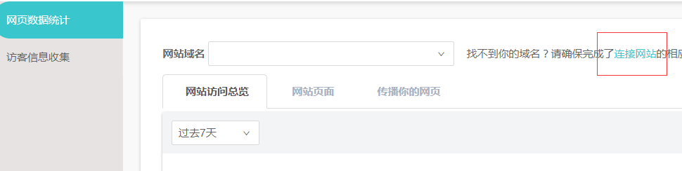

点击连接网站,在打开的页面中复制如下代码
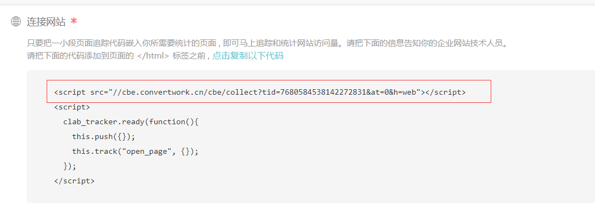

这段代码就是埋点的js文件,在每个页面中都要导入该js文件,这样就可以使用埋点功能来进行追踪和统计了


## 事件推送 js埋点

对于打开链接触发的事件,只需要在被打开的页面中放入如下代码:
```
<script  src="//cbe.convertlab.com/cbe/collect?tid=7680584538142272831&at=0&h=web">
</script>
      <script>
        clab_tracker.ready(function(){
          this.push({});
          this.track(event,targetName,targetId);
        });
</script>
```
还可以直接在链接上 添加一个属性`data-cl-event`,值为要触发的事件,如:
```
<a data-cl-event = "open_page"></a>
```
如果事件的触发不是有链接的点击触发的，也可以使用track方法来提交事件，
track方法的定义：

**track:function(event,targetName,targetId,properties,callback)**  
**properties参数为可选，如果有properties参数会替换page的properties**  
**callback 参数为可选，如果有callback在完成track发送动作后调用此方法**

对于点击按钮事件,需要在该按钮触发的onclick方法中添加如下代码:
```
if(_cl_tracker){
		   _cl_tracker.track(event,targetName,targetId);
	   }
```

|| Track方法的参数意义|
| ------------ | ------------------------------ |
|Event |事件类型|
|targetName |比如如果事件为关注公众号，targetName为公众号的名字|
|targetId |比如如果事件为关注公众号，targetId为公众号在DM Hub系统中的id|  


## 获取嵌入式form表单

### 1. 登录 DM Hub
### 2. 点击互动按钮,出现下拉框选项,选择公司网站


选择公司网站后,进入如下页面
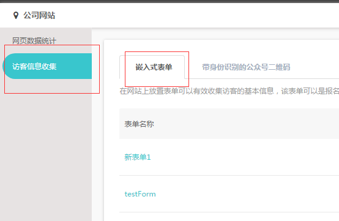

点击访客信息收集,点击后进入form表单页面,点击右侧的 **新建表单**:


这样我们就进入了创建form表单页面,表单名可自定义,页面布局如下:


左侧配置表单信息,配置form表单的属性,请点击按钮 **添加字段**


如果需要自定义属性,请点击按钮 **新建客户属性**


点击后,在输入框中输入自定义的属性名称,点击保存后,添加自定义属性成功
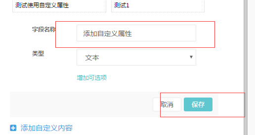

### 3. 创建form表单,点击需要的属性,右边会生成对应的表单


点击右上角的 **保存** 按钮,保存form表单

### 4. 保存成功后,跳转到form列表,列出你创建的所有的form表单,可以通过表单名称查看指定的form表单
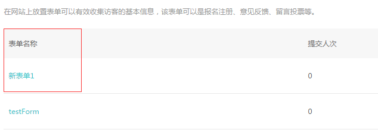

### 5. 获取form表单代码,点击按钮 **表单代码**,弹出框中显示的就是form表单的代码
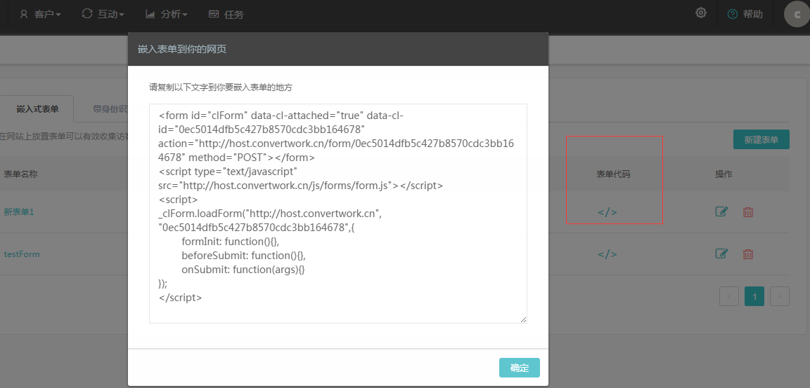

把这段代码放入需要嵌入表单的地方,就可以生成对应的form表单


## 用户自由表单提交数据
如何使用自己的form表单样式
我们已经创建好了form表单,但是原生form表单的样式是无法修改的,如果用户想要使用自己的表单样式,
操作流程如下:
### 1. 查询属性的id


进入设置中心后,点击按钮”客户属性”
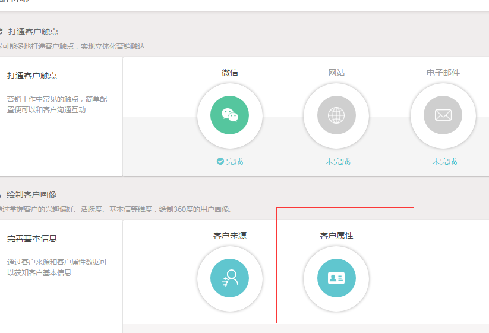

进入客户属性页面,里面有客户属性的id,包括自定义的属性


### 2. 获取action
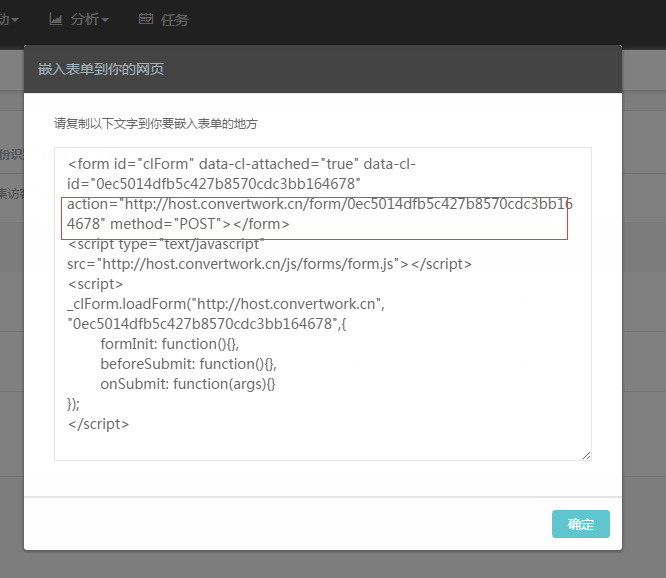

将用户的form表单中的<font color=red>name</font>和action替换为DM hub提供的<font color=red>name</font>和action,就能使用自己的form表单样式,将数据提交到DM hub中

### 3. 怎么查看uuid
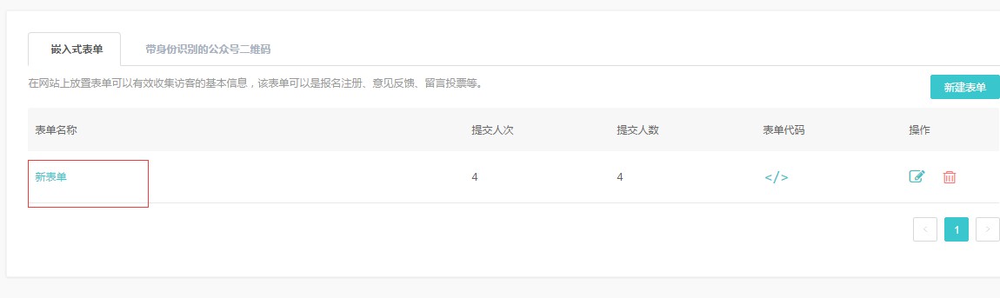

这是我们创建的表单,点击表单名称,跳转到表单数据页面,注意表单的url
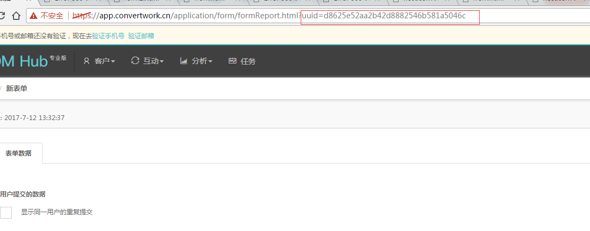

最后一个参数就是uuid

在打开页面时，发GET请求获取cltoken，该token在提交表单时使用，并且只能使用一次，如果要再次提交需重新获取cltoken,
如果要重复使用token,请参考如下demo:
**红色框注明的是要添加到外部form表单中的**
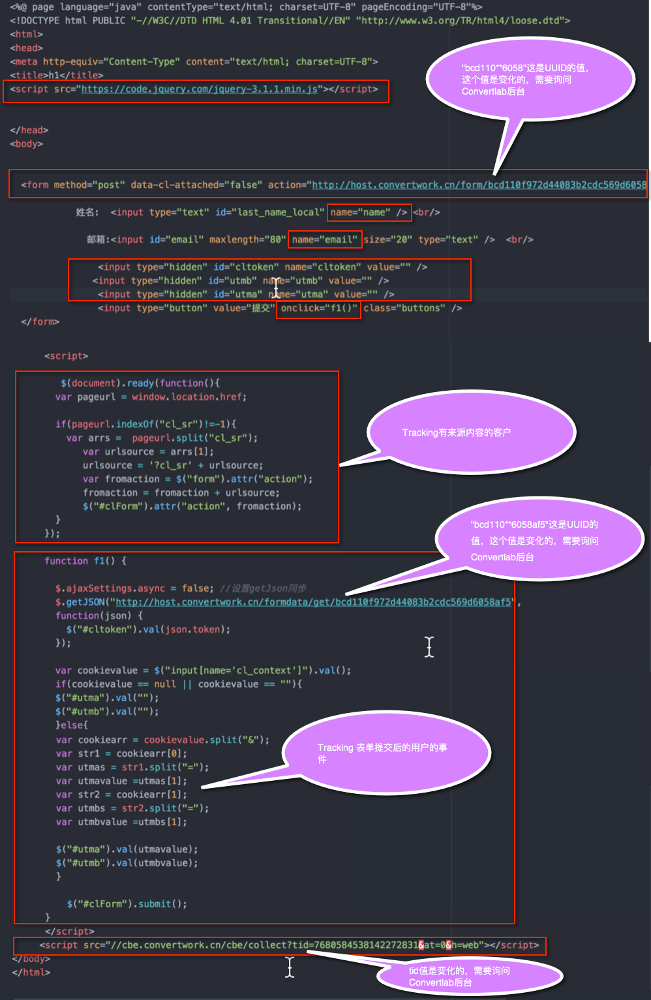

```
GET: http://host.convertlab.com/formdata/get/{uuid}    
```

返回的结果格式如下:

```
{
  "uuid": "d8625e52aa2b42d8882546b581a5046c",
  "title": "新表单",
  "content": "{\"fields\":[{\"name\":\"name\",\"type\":\"Text\",\"label\":\"姓名\",\"description\":\"\",\"required\":false,\"placeholder\":\"姓名\"},{\"name\":\"wechat\",\"type\":\"Text\",\"label\":\"微信号\",\"description\":\"\",\"required\":false,\"placeholder\":\"微信号\"}],\"btnText\":\"提交\",\"style\":{\"label\":{\"fontFamily\":\"Microsoft YaHei\",\"fontSize\":\"medium\",\"bold\":false,\"color\":\"#444444\"},\"description\":{\"fontFamily\":\"Microsoft YaHei\",\"fontSize\":\"medium\",\"bold\":false,\"color\":\"#9a9a9a\"},\"option\":{\"fontFamily\":\"Microsoft YaHei\",\"fontSize\":\"medium\",\"bold\":false,\"color\":\"#777777\"},\"lingHeight\":\"small\",\"field\":{\"radius\":\"on\",\"size\":\"1\",\"color\":\"#e6e2e2\"},\"button\":{\"shadow\":\"off\",\"size\":\"medium\",\"color\":\"#2eb2ed\",\"borderRadius\":\"on\",\"borderSize\":\"0\",\"borderColor\":\"#2eb2ed\",\"textFont\":\"Microsoft YaHei\",\"textSize\":\"medium\",\"textColor\":\"#ffffff\",\"textBold\":false,\"layout\":\"center\"}}}",
  "targetGroup": 0,
  "submitScore": 0,
  "styleId": 0,
  "style": "",
  "stage": "",
  "showLimitSubmit": false,
  "showTask": false,
  "autoFill": false,
  "taskTitle": "",
  "taskPriority": "Medium",
  "taskAssignee": "0",
  "redirectUuid": "",
  "redirectUrl": "",
  "redirectType": "text",
  "redirectText": "",
  "dateCreated": "2017-07-12T05:32:37Z",
  "lastUpdated": "2017-07-12T05:32:37Z",
  "server": "http://host.convertlab.com",
  "token": "e3f1042e4c174f7f994b1ea4dd1c551b"
}
```
获得的数据中包含名称为“token”的数据，即后续提交表单时要使用的cltoken

**怎样获取注册用户的事件**
要使用非原生的form表单,并追踪注册用户注册之前也之后的浏览与操作记录,还需要如下配置:
1. 将form表单的data-cl-attached 的值设置为 false
2. 在form表单中添加   
```
<input type="hidden" id="utmb" name="utmb" value="" />
<input type="hidden" id="utma" name="utma" value="" />
```

Form表单示例与js方法示例:
```
<form method="post" data-cl-attached="false"
  action="http://host.convertlab.com/form/bcd110f972d44083b2cdc569d6058af5"
  name="clForm" id="clForm">

            姓名:  <input type="text" id="last_name_local" name="name" /> <br/>

              邮箱:<input id="email" maxlength="80" name="email" size="20" type="text" />  <br/>

                <input type="hidden" id="cltoken" name="cltoken" value="" />
               <input type="hidden" id="utmb" name="utmb" value="" />
                <input type="hidden" id="utma" name="utma" value="" />  
                <input type="button" value="提交" onclick="f1()" class="buttons" />
  </form>


      <script>
   	  function f1(){
	      $.ajaxSettings.async = false; //设置getJson同步
	      $.getJSON("http://host.convertlab.com/formdata/get/bcd110f972d44083b2cdc569d6058af5",
	      function(json) {
	        $("#cltoken").val(json.token);
	      });

   		  var cookievalue = $("input[name='cl_context']").val();
   		  if(cookievalue == "" || cookievalue == null){
   			$("#utma").val("");
     		$("#utmb").val("");
   		  }else{
   			var cookiearr = cookievalue.split("&");
     		var str1 = cookiearr[0];
     		var utmas = str1.split("=");
     		var utmavalue =utmas[1];
     		var str2 = cookiearr[1];
     		var utmbs = str2.split("=");
     		var utmbvalue =utmbs[1];

     		$("#utma").val(utmavalue);
     		$("#utmb").val(utmbvalue);
   		  }
     		var fromurl = $("form").attr("action");
	      $.ajax({
              cache: true,
              type: "POST",
              url:fromurl,
              data:$('#clForm').serialize(),// 你的formid
              async: false,
              error: function(request) {
                  alert("Connection error");
              },
              success: function(data) {
            	  alert("success");
            	  window.location="dengbaishi2.jsp";
              }
          });
	    }
      </script>

      <script src="//cbe.convertlab.com/cbe/collect?tid=7680584538142272831&at=0&h=web"></script>
      <script>
        clab_tracker.ready(function(){
          this.push({});
          this.track("open_page","form表单","11");

        });
      </script>
```

## 来源跟踪
如果要将网站页面投放到外部营销渠道（例如百度），你可以为URL加上渠道来源参数，进行来源追踪和统计
操作流程如下:
点击互动,在下拉列表中选择公司网站


在进入的页面中点击


在这里可以设置可追踪来源的url,点击 **新建可追踪url**


可配置来源与来源内容

将以下该代码封装入js文件中,在每个页面中都要导入该js文件
```
$(document).ready(function(){
    	  var pageurl = window.location.href;
    	  var urlsource = "";
    	  if(pageurl.indexOf("cl_sr")!=-1){
    		  var arrs =  pageurl.split("cl_sr");
    	    	 var urlsource = arrs[1];
    	    	 urlsource = '?cl_sr' + urlsource;
    	  }

          $('a').each(function(){
        	    var href = $(this).attr('href');
        	    if(urlsource != ""){
        	    	var Ahref = href + urlsource;
        	    	$(this).attr("href",Ahref);
        	    }

        	});

    	});
```
**这样我们就能追踪到用户的来源**     
