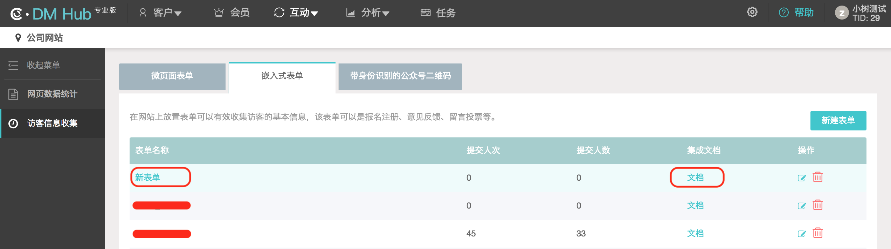

## 1. 网站埋点说明

DM Hub 中的网站埋点功能可以帮您统计网站流量，追踪流量来源，捕获网站访客信息。

比起单一的网站流量统计与追踪，DM Hub 能够将线索在各渠道留下的痕迹整合，为营销人员提供完整的客户画像，以进行更加精准的营销与内容推送。

## 2. 设置追踪网站

在【设置】-【设置中心】中选择【网站】模块进行追踪网站设置。


### 2.1 嵌入追踪代码


在所有需要统计的网站页面中嵌入追踪代码：

```javascript
<script src="//cbe.convertlab.com/cbe/collect?tid={YOUR_TID}&at=0&h=web"></script>
<script>
  clab_tracker.ready(function(){
    this.push({"pageType": "web"});
    this.track("open_page", {});
  });
</script>
```

其中的 `{YOUR_TID}` 是变化的，请前往追踪网站设置页面获取。

### 2.2 设置追踪域名


设置要追踪的网站的域名，只有设置过的域名才会被追踪。

## 3. 跟踪客户事件

### 3.1 打开链接触发的事件

对于打开链接触发的事件，有两种方式来进行跟踪，开发者可以根据使用需求选择其中一种方式。

- 方式一

在被打开的页面中放入如下代码：

```javascript
<script src="//cbe.convertlab.com/cbe/collect?tid={YOUR_TID}&at=0&h=web"></script>
<script>
  clab_tracker.ready(function(){
    this.push({});
    this.track(event, targetName, targetId);
  });
</script>
```

其中的 `{YOUR_TID}` 是变化的，请前往追踪网站设置页面获取。

- 方式二

在链接上添加 `data-cl-event` 属性，值 `{event}` 为要触发的事件：

```
<a data-cl-event="{event}"></a>
```

### 3.2 其他行为触发的事件

如果事件不是由打开链接触发的，可以通过如下 `track` 方法来提交事件：

```javascript
if (clab_tracker) {
  clab_tracker.track(event, targetName, targetId, properties, callback);
}
```

`track` 方法参数说明：

| 参数 | 说明 |
| ------ | ------ |
| event | 事件 id |
| targetName | 比如事件为关注公众号，targetName 为公众号的名字 |
| targetId | 比如事件为关注公众号，targetId 为公众号在 DM Hub 系统中的 id |
| properties | 可选，如果有 properties 参数会替换 page 的 properties |
| callback | 可选，如果有 callback 在完成 track 发送动作后调用此方法 |

## 4. 获取嵌入式表单

### 4.1 新建表单

登录 DM Hub 系统，在【互动】-【公司网站】中选择【访客信息收集】-【嵌入式表单】新建嵌入式表单。


根据实际需求创建表单完成后，点击【保存】完成创建。


### 4.2 集成表单

表单创建完成后，在嵌入式表单列表中就会出现新创建的表单，开发者可以点击对应表单的【文档】按钮查看表单的集成文档。



#### 4.2.1 场景一：使用 DM Hub 嵌入式表单

使用该方式将自动在网页上生成表单，无需自行开发。

```javascript
<form id="clForm" data-cl-attached="true" data-cl-id="{表单UUID}" action="http://host.convertlab.com/form/{表单UUID}" method="POST"></form>
<script type="text/javascript" src="http://host.convertlab.com/js/forms/form.js"></script>
<script>
  _clForm.loadForm("http://host.convertlab.com", "{表单UUID}",{
    formInit: function(){},
    beforeSubmit: function(){},
    onSubmit: function(args){}
  });
</script>
```

其中 `{表单UUID}` 填写在 DM Hub 中创建的具体表单的 uuid。此外，需要在网页的合适地方嵌入追踪脚本，嵌入方式参考 [2. 设置追踪网站](#2)。

#### 4.2.2 场景二：使用自定义表单

如果需要使用自定义表单，请按照下述步骤自行开发：

1. 自行开发表单，并在 DM Hub 中创建相同字段的嵌入式表单用来接收数据。请确保自定义表单字段的 `name` 属性和生成的嵌入式表单中对应字段的 `name`（即 DM Hub 客户属性 ID）相同。

2. 在自定义表单的 form 标签中增加如下两个 data 属性： `data-cl-attached="false" data-cl-id="{表单UUID}"`，其中 `{表单UUID}` 填写在 DM Hub 中创建的具体表单的 uuid。

3. 按要求嵌入追踪脚本，嵌入方式参考 [2. 设置追踪网站](#2)。

4. 追踪脚本会在表单中增加如下字段： `<input type="hidden" name="cl_context" value="utma=xxx.xxx&utmb=xxx.xxx">`

5. 发 GET 请求获取 cltoken，该 token 在提交表单时使用，并且只能使用一次，如果要再次提交需重新获取 cltoken。获取方式如下：GET: `http://host.convertlab.com/formdata/get/{表单UUID}`，其中 `{表单UUID}` 填写具体表单的 uuid。获得的数据中包含名称为 `token` 的数据，即后续提交表单时要使用的 cltoken。

6. 提交表单时，将表单数据以 form data 的形式提交，请注意字段名称必须和创建的嵌入式表单匹配，同时 form data 里需额外增加一个字段 cltoken，值为前面请求取到的 token 值。隐藏字段 cl_context 里面的 utma 和 utmb 也请一并提交。提交表单的地址：POST: `http://host.convertlab.com/page/{表单UUID}?channelType={channelType}&userId={userId}`，其中 `{表单UUID}` 填写具体表单的 uuid，`{channelType}` 和 `{userId}` 根据实际情况酌情添加，`{channelType}` 表示当前渠道，例如 wechat，`{userId}` 表示用户在当前渠道的 ID，例如当前用户的 openId。

使用自定义表单的示例代码：

```
<form id="clForm" method="post" data-cl-attached="false" action="http://host.convertlab.com/page/{表单UUID}?channelType={channelType}&userId={userId}">
  <!-- 此处示例 3 个表单字段，实际开发中请确保每个字段的 name 属性和 DM Hub 中创建的嵌入式表单中对应字段的 name 相同 -->
  <!-- DM Hub 预置客户属性，DM Hub 预置，不可修改 -->
  姓名：<input type="text" name="name" /><br/>
  <!-- DM Hub 预置客户属性，DM Hub 预置，不可修改 -->
  手机号码：<input type="text" name="mobile" /><br/>
  <!-- DM Hub 自定义客户属性，根据业务需求自行创建 -->
  自定义属性：<input type="text" name="attr1" /><br/>
  
  <input type="hidden" id="cltoken" name="cltoken" value="" />
  <input type="hidden" id="utmb" name="utmb" value="" />
  <input type="hidden" id="utma" name="utma" value="" />
  <input type="button" value="提交" onclick="f1()" class="buttons" />
</form>

<script>
  function f1() {
    $.ajaxSettings.async = false;
    $.getJSON("http://host.convertlab.com/formdata/get/{表单UUID}", function(json) {
      $("#cltoken").val(json.token);
    });

    var cookievalue = $("input[name='cl_context']").val();
    if (cookievalue == "" || cookievalue == null) {
      $("#utma").val("");
      $("#utmb").val("");
    } else {
      var cookiearr = cookievalue.split("&");
      var str1 = cookiearr[0];
      var utmas = str1.split("=");
      var utmavalue =utmas[1];
      var str2 = cookiearr[1];
      var utmbs = str2.split("=");
      var utmbvalue =utmbs[1];

      $("#utma").val(utmavalue);
      $("#utmb").val(utmbvalue);
    }

    var fromurl = $("form").attr("action");
    $.ajax({
      cache: true,
      type: "POST",
      url:fromurl,
      data:$('#clForm').serialize(),
      async: false,
      error: function(request) {
        alert("Connection error");
      },
      success: function(data) {
        alert("success");
        window.location="xxxxxx.jsp";
      }
    });
  }
</script>
```

## 5. 用户来源跟踪

如果需要将网站页面投放到外部营销渠道（例如百度），可以在 URL 中加上渠道来源参数，进行来源追踪和统计。

### 5.1 新建可追踪 URL

登录 DM Hub 系统，在【互动】-【公司网站】中选择【网页数据统计】-【传播你的网页】新建可追踪 URL。


### 5.2 网站页面引入 JS 代码

创建可追踪 URL 后，在网站的每个页面中都需要引入如下 JS 代码：

```javascript
$(document).ready(function() {
  var pageurl = window.location.href;
  var urlsource = "";
  if(pageurl.indexOf("cl_sr") != -1) {
    var arrs = pageurl.split("cl_sr");
    var urlsource = arrs[1];
    urlsource = "?cl_sr" + urlsource;
  }

  $("a").each(function() {
    var href = $(this).attr("href");
    if(urlsource != "") {
      var Ahref = href + urlsource;
      $(this).attr("href", Ahref);
    }
  });
});
```
