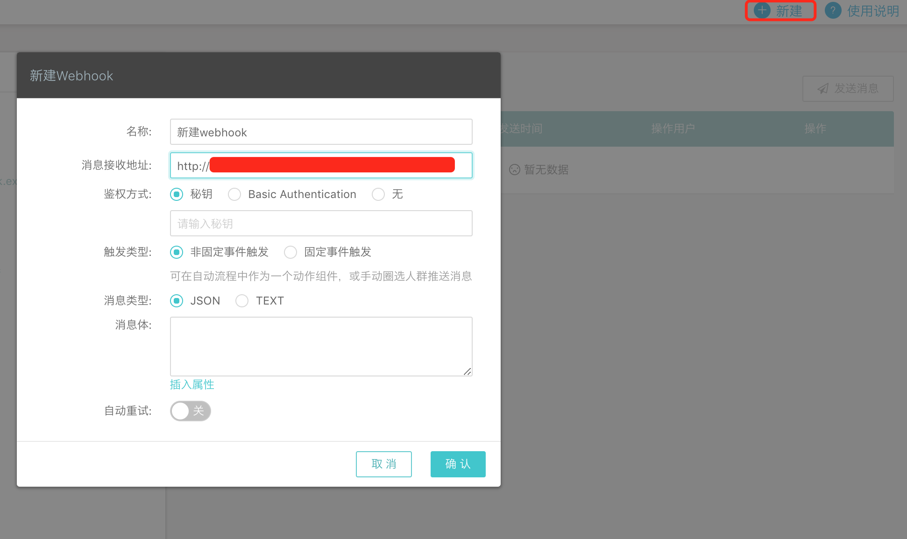
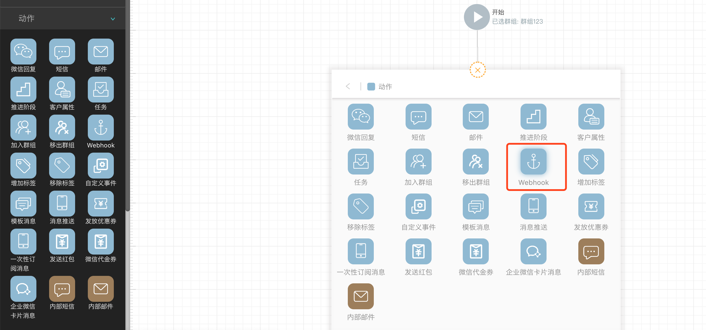
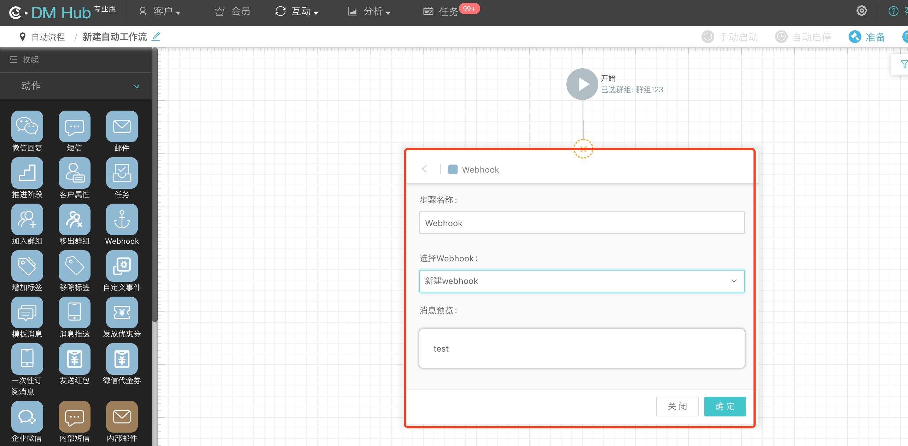
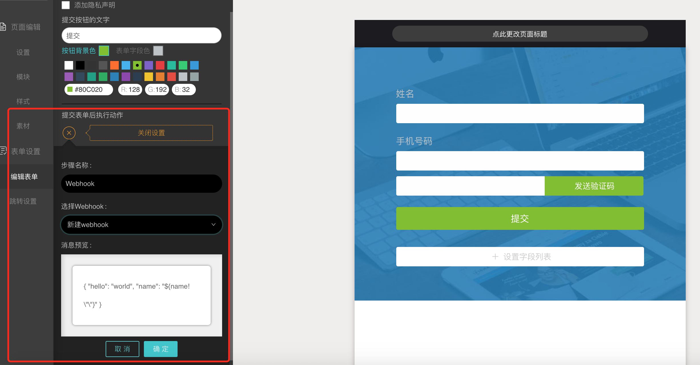

## 1. Webhook 简介

DM Hub 平台提供了各种 Open API 供外部系统调用，但在某些情况下，可能需要 DM Hub 在**合适的时刻**能够**主动推送消息**给外部系统，例如在自动流程执行到特定步骤时，能推送消息给客户的各种终端系统。

Webhook 功能就是 DM Hub 提供的消息推送机制，能够给在 DM Hub 平台上注册过的接口推送消息。

比如，如果某个客户活跃度达到了 500 分，达到你公司的“高质量线索”标准，你就可以以“活跃度达到 500 分”为触发条件，使用DM Hub 的 Webhook 功能，自动给你的 CRM 系统发送此通知，将该客户等级上调。

## 2. 新建 Webhook

在【设置】-【Webhook】中新建 Webhook，填写相关参数配置后，点击【保存】完成创建。
 


参数说明：

- Web Hook 配置名称：给新建的 Webhook 起一个有意义的名称，该名称会显示在左侧的列表中，方便后续查看和更改。

- 消息接收地址：要接收消息推送的接口地址，必须是合法的完整地址，包含使用的协议（如 http 或 https）。

- 鉴权方式：用于对消息传递的安全性进行保护。
	- 秘钥：用于对消息内容进行签名，在接收到消息时进行[验签](#61-webhook)，从而保证消息来源以及消息内容没有被篡改过。
	- Basic Authentication: 发送消息到接收服务器时，会在Http header中加上预先设置好的身份信息，以保证消息接收服务器的安全。


- 触发类型
  
- 非固定事件触发： 可在自动流程中作为一个动作组件，或手动圈选人群推送消息。选择此触发类型，需设置消息类型和消息体。[见7.1非固定事件触发](#71)

	- 消息类型： 可选择以Json或者文本格式发送消息。如果消息类型为Json，则Http header中的Content-Type为`application/json`，如果为文本则为`text/plain`

	- 消息体：可自定义消息内容，并可选择插入客户的属性。

	- 选择会员属性/选择客户属性：从下拉列表中选取一个会员/客户属性，添加到消息体中。

	- 属性为空时显示内容：当选择的会员/客户属性不存在，则以此项内容填充到消息体中。
    
- 固定事件触发：指定触发事件后，发生该事件将自动触发此webhook。目前可选择的事件包括会员等级升级，会员等级降级，系统发放优惠券，领取优惠券和核销优惠券。[见7.2固定事件触发](#72)

- 是否激活：DM Hub 只会向处于激活状态的 Webhook 推送消息，如果不想接收消息推送，则可以在此关闭推送功能。

- 是否自动重试：如果推送失败，会自动进行重试。自动重试机制：间隔 30 分钟左右进行第 1 次重试，之后每次重试的间隔递增 30 分钟左右，直至推送成功或自动重试次数达到 3 次。

## 3. 群发 Webhook消息

Webhook创建完成后，如果该Webhook的触发类型为非固定事件触发，需要进行手动群发。

发送步骤：

1. 在Webhook列表中选择需要群发的Webhook，点击发送消息按钮。  

2. 选择群发

3. 在发送至群组的下拉列表中选择群组  

4. 选择发送时间  
如果选择定时发送则系统会在指定的时间开始发送Webhook消息。


## 4. 测试 Webhook

在针对群组进行群发Webhook之前，可选择某个用户来发送单条消息以进行测试


测试步骤：

1. 在Webhook列表中选择需要群发的Webhook，点击发送消息按钮。 

2. 选择测试发送

3. 在请选择客户的输入框中输入客户姓名、微信昵称或者手机号码。

## 5. 查看发送结果
在webhook列表中可查看webhook发送的结果。

1. 如果是测试消息，可查看到消息发送的详情，包括消息体、消息头以及服务器的响应结果

2. 如果是群发的webhook消息，可以在发送列表页上看到该消息的发送状态：发送中、已完成等。

## 6. Webhook 鉴权

### 6.1 Webhook秘钥

对于设置了秘钥的 Webhook，DM Hub 向消息接收地址发送请求时，会使用秘钥生成消息内容的 hmac sha256 hex 摘要签名，携带在 header 的 `X-Clab-Hmac-Signature` 中。

在接收消息的代码中，使用相同的秘钥生成接收到的 payload 的 hmac sha256 hex 摘要签名，并与 header 中的签名进行比对，如果两者一致，则验签通过，表明消息来源可靠且消息内容没有被篡改过。

生成 hmac sha256 hex 摘要签名：

- 使用的 jar 包：

```
com.google.code.gson:gson:2.8.1
commons-codec:commons-codec:1.10
```

- 生成签名代码示例：

```java
import com.google.gson.Gson
import com.google.gson.GsonBuilder
import org.apache.commons.codec.digest.HmacUtils

String sign(Map payload, String secret) {
    Gson gson = new GsonBuilder().create();
    String str = gson.toJson(payload);
    return HmacUtils.hmacSha256Hex(secret, str.replaceAll("\\s+", ""));
}
```

### 6.2 基本身份认证
对于设置了基本身份认证的 Webhook， DM Hub想消息地址发送请求时，会在http header中添加Authorization，示例代码如下：

```java
String content = username + ":" + password;
String token = "Basic " + Base64.getEncoder().encodeToString(content("utf-8"));
httpPost.setHeader("Authorization", token);
```


## 7. Webhook 触发类型说明

Webhook 支持消息类型包括：自动流相关、表单提交相关以及会员相关，具体使用如下所述。

### 7.1 固定事件触发
#### 7.1.1 使用 Webhook 接收自动流相关消息

如下图所示，在创建自动流程时，可以添加 Webhook 动作节点，用以将相关的上下文信息通过 Webhook 推送给外部系统。





#### 7.1.2 使用 Webhook 接收表单提交相关消息

如下图所示，在包含表单的微页面中，可以设置提交表单后触发 Webhook，用以将相关的上下文信息通过 Webhook 推送给外部系统。




### 7.2 固定事件触发

目前支持以下5种会员相关事件。

#### 7.2.1 会员等级升级事件

`loyalty/membership_level_up`

消息内容 payload：

```json
{
    "tenantId": <tenantId>,
    "event": "loyalty/membership_level_up",
    "membershipId": "<会员 ID>",
    "date": "<事件发生的时间>",
    "oldLevelId": <原等级 ID>,
    "newLevelId": <新等级 ID>,
    "oldLevel": "<原等级名称>",
    "newLevel": "<新等级名称>"
}
```

#### 7.2.2 会员等级降级事件

`loyalty/membership_level_down`

消息内容 payload：

```json
{
    "tenantId": <tenantId>,
    "event": "loyalty/membership_level_down",
    "membershipId": "<会员 ID>",
    "date": "<事件发生的时间>",
    "oldLevelId": <原等级 ID>,
    "newLevelId": <新等级 ID>,
    "oldLevel": "<原等级名称>",
    "newLevel": "<新等级名称>"
}
```

#### 7.2.3 系统发放优惠券事件

`loyalty/loyalty_dispatch_coupon`

消息内容 payload：

```json
{
    "tenantId": <tenantId>,
    "event": "loyalty/loyalty_dispatch_coupon",
    "membershipId": "<会员 ID>",
    "date": "<事件发生的时间>",
    "couponId": "<优惠券 ID>",
    "couponName": "<优惠券名称>",
    "batchId": "<批次号>",
    "couponCode": "<优惠券 code（该客户的唯一 code）>",
    "startDate": "<起始有效日期>",
    "endDate": "<截止有效日期>"
}
```

#### 7.2.4 领取优惠券事件

`loyalty/membership_draw_coupon`

消息内容 payload：

```json
{
    "tenantId": <tenantId>,
    "event": "loyalty/membership_draw_coupon",
    "membershipId": "<会员 ID>",
    "date": "<事件发生的时间>",
    "couponId": "<优惠券 ID>",
    "couponName": "<优惠券名称>",
    "couponCode": "<优惠券 code（该客户的唯一 code）>",
    "startDate": "<起始有效日期>",
    "endDate": "<截止有效日期>"
}
```

#### 7.2.5 核销优惠券事件

`loyalty/membership_redeem_coupon`

消息内容 payload：

```json
{
    "tenantId": <tenantId>,
    "event": "loyalty/membership_redeem_coupon",
    "membershipId": "<会员 ID>",
    "date": "<事件发生的时间>",
    "couponId": "<优惠券 ID>",
    "couponName": "<优惠券名称>",
    "couponCode": "<优惠券 code（该客户的唯一 code）>"
}
```
