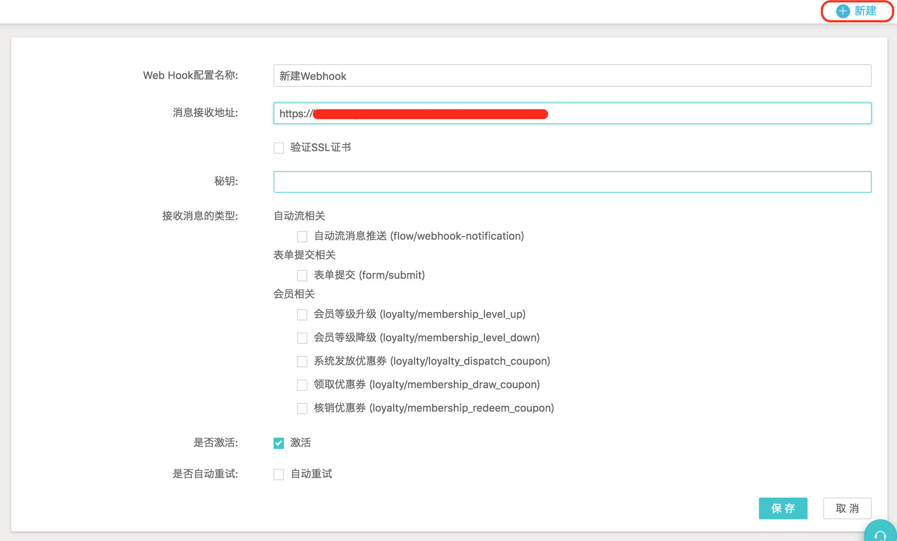
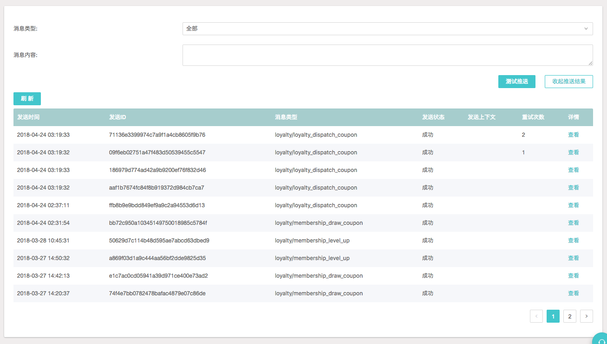
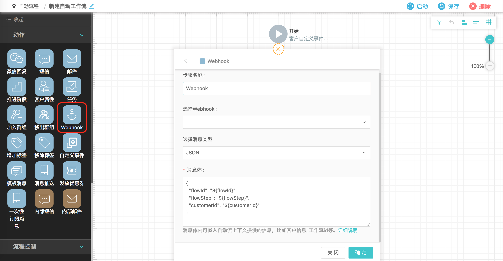
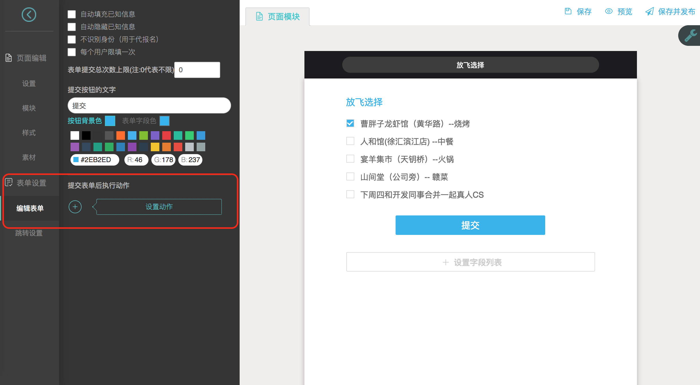
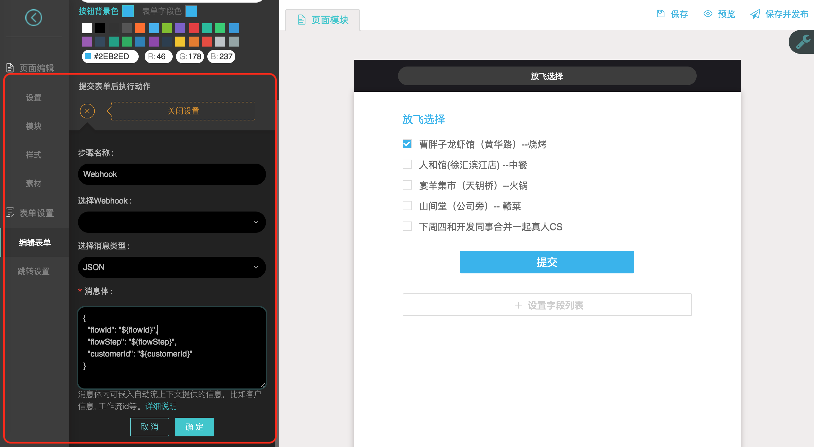

## 1. Webhook 简介

DM Hub 平台提供了各种 Open API 供外部系统调用，但在某些情况下，可能需要 DM Hub 在**合适的时刻**能够**主动推送消息**给外部系统，例如在自动流程执行到特定步骤时，能推送消息给客户的各种终端系统。

Webhook 功能就是 DM Hub 提供的消息推送机制，能够给在 DM Hub 平台上注册过的接口推送消息。

比如，如果某个客户活跃度达到了 500 分，达到你公司的“高质量线索”标准，你就可以以“活跃度达到 500 分”为触发条件，使用DM Hub 的 Webhook 功能，自动给你的 CRM 系统发送此通知，将该客户等级上调。

## 2. 新建 Webhook

在【设置】-【Webhook】中新建 Webhook，填写相关参数配置后，点击【保存】完成创建。



参数说明：

- Web Hook 配置名称：给新建的 Webhook 起一个有意义的名称，该名称会显示在左侧的列表中，方便后续查看和更改。

- 消息接收地址：要接收消息推送的接口地址，必须是合法的完整地址，包含使用的协议（如 http 或 https）。

- 验证 SSL 证书：填写 `https` 开头的消息接收地址后会出现该选项，对于 `https` 协议的消息接收地址，默认会验证 SSL 证书，如果不需要验证，请不要勾选该选项。

- 秘钥：填写 `https` 开头的消息接收地址后会出现该选项，请填写 SSL 证书对应的秘钥，用于对消息内容进行签名，在接收到消息时进行[验签](#4-webhook)，从而保证消息来源以及消息内容没有被篡改过。

- 接收消息的类型：不同的类型对应不同的使用场景，详见 [5. Webhook 消息类型说明](#5-webhook)。

- 是否激活：DM Hub 只会向处于激活状态的 Webhook 推送消息，如果不想接收消息推送，则可以在此关闭推送功能。

- 是否自动重试：如果推送失败，会自动进行重试。

## 3. 测试 Webhook

Webhook 创建完成后，可以对 Webhook 的推送配置进行测试。



测试步骤：

1. 选择消息类型，默认选择全部。

2. 在消息内容文本框里输入消息内容，消息内容必须是接受消息推送的接口可以识别的消息类型。

3. 点击【测试发送】按钮进行测试。

4. 点击【查看推送结果】按钮可查看测试推送的历史记录。

## 4. Webhook 验签

对于设置了秘钥的 Webhook，DM Hub 向消息接收地址发送请求时，会使用秘钥生成消息内容的 hmac sha256 hex 摘要签名，携带在 header 的 `X-Clab-Hmac-Signature` 中。

在接收消息的代码中，使用相同的秘钥生成接收到的 payload 的 hmac sha256 hex 摘要签名，并与 header 中的签名进行比对，如果两者一致，则验签通过，表明消息来源可靠且消息内容没有被篡改过。

生成 hmac sha256 hex 摘要签名：

- 使用的 jar 包：

```
com.google.code.gson:gson:2.8.1
commons-codec:commons-codec:1.10
```

- 生成签名代码示例：

```java
import com.google.gson.Gson
import com.google.gson.GsonBuilder
import org.apache.commons.codec.digest.HmacUtils

String sign(Map payload, String secret) {
    Gson gson = new GsonBuilder().create();
    String str = gson.toJson(payload);
    return HmacUtils.hmacSha256Hex(secret, str.replaceAll("\\s+", ""));
}
```

## 5. Webhook 消息类型说明

### 5.1 使用 Webhook 接收自动流相关消息

如下图所示，在创建自动流程时，可以添加 Webhook 动作节点，用以将相关的上下文信息通过 Webhook 推送给外部系统。Webhook 的消息体可以根据实际需求进行定制，详见 [Webhook 消息体定制说明](webhook_payload)。



### 5.2 使用 Webhook 接收表单提交相关消息

如下图所示，在包含表单的微页面中，可以设置提交表单后触发 Webhook，用以将相关的上下文信息通过 Webhook 推送给外部系统。Webhook 的消息体可以根据实际需求进行定制，详见 [Webhook 消息体定制说明](http://api-docs.convertlab.com/webhook/webhook_payload/)。





### 5.3 使用 Webhook 接收会员相关消息

如果开通了会员功能，则可以使用 Webhook 接收会员相关消息，用以将会员相关事件发生时的上下文信息通过 Webhook 推送给外部系统。目前支持 5 种会员相关事件。

#### 5.3.1 会员等级升级

`loyalty/membership_level_up`

```json
{
    "tenantId": <tenantId>,
    "event": "loyalty/membership_level_up",
    "membershipId": "<会员 ID>",
    "date": "<事件发生的时间>",
    "oldLevelId": <原等级 ID>,
    "newLevelId": <新等级 ID>,
    "oldLevel": "<原等级名称>",
    "newLevel": "<新等级名称>"
}
```

#### 5.3.2 会员等级降级

`loyalty/membership_level_down`

```json
{
    "tenantId": <tenantId>,
    "event": "loyalty/membership_level_down",
    "membershipId": "<会员 ID>",
    "date": "<事件发生的时间>",
    "oldLevelId": <原等级 ID>,
    "newLevelId": <新等级 ID>,
    "oldLevel": "<原等级名称>",
    "newLevel": "<新等级名称>"
}
```

#### 5.3.3 系统发放优惠券

`loyalty/loyalty_dispatch_coupon`

```json
{
    "tenantId": <tenantId>,
    "event": "loyalty/loyalty_dispatch_coupon",
    "membershipId": "<会员 ID>",
    "date": "<事件发生的时间>",
    "couponId": "<优惠券 ID>",
    "couponName": "<优惠券名称>",
    "batchId": "<批次号>",
    "couponCode": "<优惠券 code（该客户的唯一 code）>",
    "startDate": "<起始有效日期>",
    "endDate": "<截止有效日期>"
}
```

#### 5.3.4 领取优惠券

`loyalty/membership_draw_coupon`

```json
{
    "tenantId": <tenantId>,
    "event": "loyalty/membership_draw_coupon",
    "membershipId": "<会员 ID>",
    "date": "<事件发生的时间>",
    "couponId": "<优惠券 ID>",
    "couponName": "<优惠券名称>",
    "couponCode": "<优惠券 code（该客户的唯一 code）>",
    "startDate": "<起始有效日期>",
    "endDate": "<截止有效日期>"
}
```

#### 5.3.5 核销优惠券

`loyalty/membership_redeem_coupon`

```json
{
    "tenantId": <tenantId>,
    "event": "loyalty/membership_redeem_coupon",
    "membershipId": "<会员 ID>",
    "date": "<事件发生的时间>",
    "couponId": "<优惠券 ID>",
    "couponName": "<优惠券名称>",
    "couponCode": "<优惠券 code（该客户的唯一 code）>"
}
```
